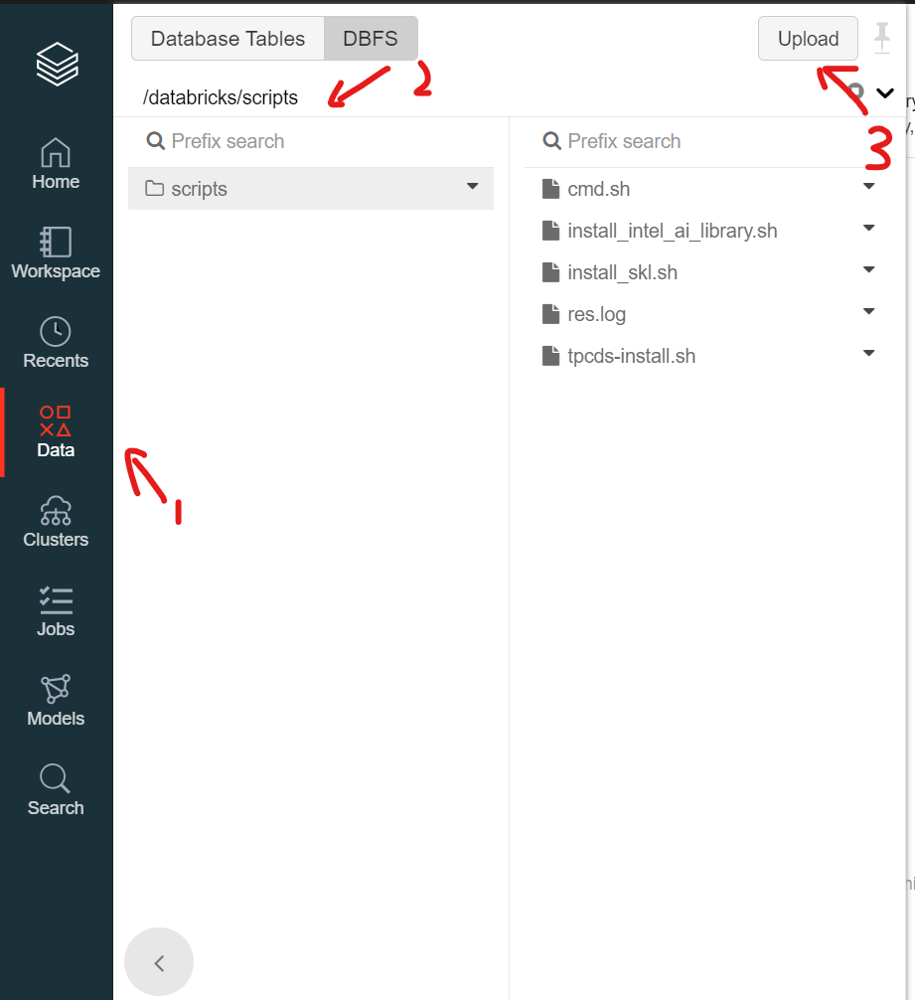
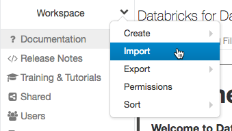

# Use Intel Optimized ML libraries on Azure Databricks cloud with Databricks Runtime 7.5 ML 
This document is used to guide the steps of creating clusters with Intel Optimized ML libraries on Databricks.

## 1. Upload init script

Upload the init script **[init_intel_optimized_ml.sh](./init_intel_optimized_ml.sh)** to Databricks DBFS:

1. Download **[init_intel_optimized_ml.sh](./init_intel_optimized_ml.sh)** to a local folder.
2. Click **Data** icon in the left sidebar.
3. Click the **DBFS** button and then **Upload** button at the top.
4. Select a target directory, for example, FileStore, in the **Upload Data to DBFS** dialog, 
5. Browse to the file **[init_intel_optimized_ml.sh](./init_intel_optimized_ml.sh)** in the local folder to upload in the Files box, 

## 2. Create a new cluster using the init script
To create a new cluster using the uploaded init script, follow the following steps:

1. Click the  **Clusters** icon in the left sidebar.
2. Choose the Cluster Mode and Databricks Runtim Version **Runtime:7.5 ML**.
3. Click the **Advanced Options** toggle on the cluster configuration page,
4. Click the **Init Scripts** tab at the bottom of the page, 
5. Select the "DBFS" destination type in the **Destination** drop-down,
6. Specify a path to the init script. In the example in the preceding section, the path is **dbfs:/FileStore/init_intel_optimized_ml.sh**. The path must begin with dbfs:/.
7. Click **Add**. 

## 3. Run benchmark notebooks for performance comparisons

###  Import the notebooks
You should import the **notebook**  we provided to Workspace to run benchmark notebooks.

1. Download the notebooks **[benchmark_tensorflow.ipynb](./notebooks/benchmark_tensorflow.ipynb)** and **[benchmark_sklearn.ipynb](./notebooks/benchmark_sklearn.ipynb)** to your local folder.
2. Click the  **Workspace** icon or the  **Home** icon in the left sidebar.
3. Click **Down** caret in the Workspace or a user folder and select Import. 

4. Browse to the notebook files downloaded to the local folder.
5. Click **Import**.

### Run benchmark notebooks
#### Run benchmark_sklearn notebook
 1. Create cluster with Databricks ML Runtime or Databricks ML Runtime with Intel Optimized ML libraries as described above. For the Node type, we recommend to use **Standard_F16s_v2** or **Standard_F32s_v2**.
 2. Open the notebook *benchmark_sklearn* and attached it to the corresponding cluster you created.
 3. Click **Run All**.
   
#### Run benchmark_tensorflow notebook
 1. Create cluster with Databricks ML Runtime or Databricks ML Runtime with Intel Optimized ML libraries as described above. For the Node type, we recommend to use **Standard_F16s_v2** or **Standard_F32s_v2**.
 2. Open the notebook *benchmark_tensorflow* and attached it to the corresponding cluster you created.
 3. Configure the parameter cores_per_socket at the top of the notebook to the same value of ***Core(s) per socket*** output by **"lscpu"** command.
 4. Click **Run All**.

