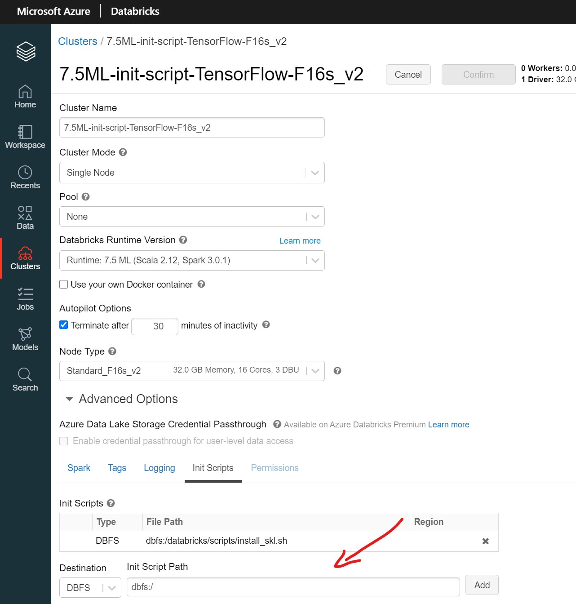

# Use init-script with intel libraries to create clusters on Databricks
This directory contains scripts useful to create clusters with intel optimized AI libraries on Databricks.

## 1. Upload init script 

Upload the init script **[install_intel_libraries.sh](./install_intel_libraries.sh)** as shown in the picture
    

## 2. Create a new cluster and start it
To use the cluster configuration page to configure a cluster to run an init script:

1. On the cluster configuration page, click the Advanced Options toggle.
2. At the bottom of the page, click the Init Scripts tab.

    

3. In the Destination drop-down, select a destination type. In the example in the preceding section, the destination is DBFS.

4. Specify a path to the init script. In the example in the preceding section, the path is **dbfs:/databricks/scripts/install_intel_libraries.sh**. The path must begin with dbfs:/.

5. Click Add.