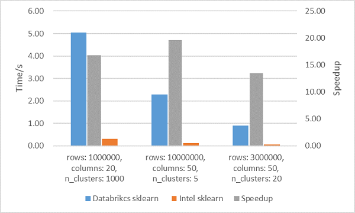
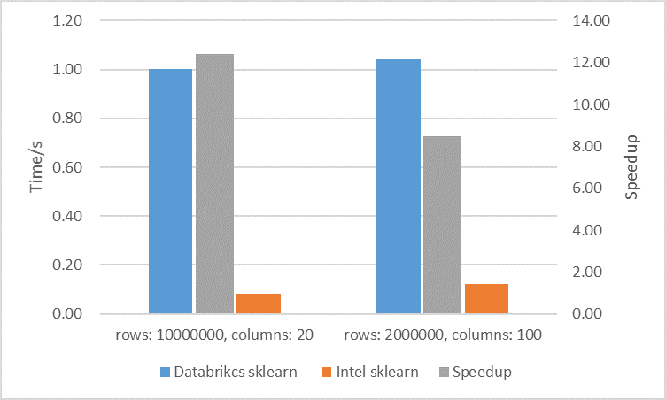
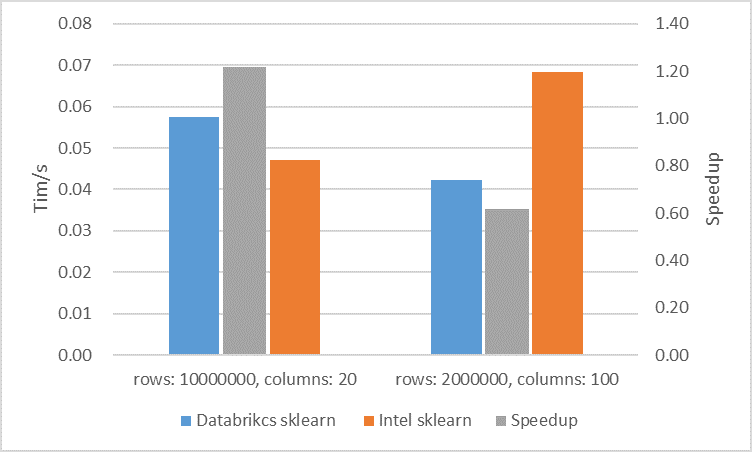
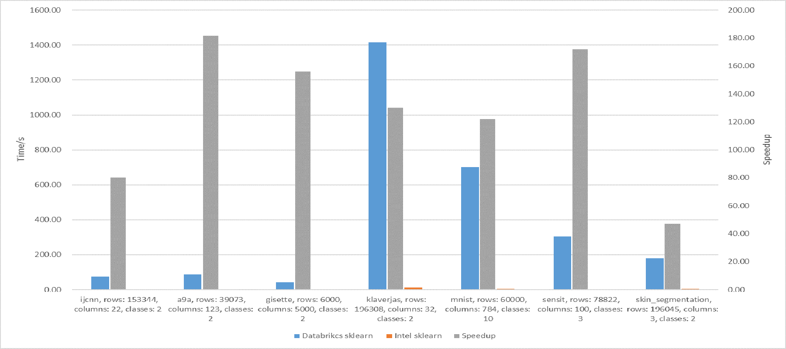

# Speed up Azure Databricks Machine Learning Runtime with Intel Optimized ML Libraries

### 1. Intel Optimized ML Libraries 

+ Scikit-learn 

Scikit-learn (formerly scikits.learn and also known as sklearn) is a free software machine learning library for the Python programming language. It features various classification, regression and clustering algorithms including support vector machines, random forests, gradient boosting, k-means and DBSCAN, and is designed to interoperate with the Python numerical and scientific libraries NumPy and SciPy.

The Intel optimizations for scikit-learn, made available through Intel® oneAPI AI Toolkit, reduce algorithm run times and gives data scientists time back to focus on their problem-solving models. Intel has invested in optimizing performance of Python* itself, with the Intel® Distribution of Python, and has optimized key data science libraries used with scikit-learn, such as XGBoost, NumPy, and SciPy. Users can install it by Intel Conda channel or refer [scikit-learn-intelex](https://github.com/intel/scikit-learn-intelex#%EF%B8%8F-get-started)  to get more information.

+ Tensorflow 

TensorFlow is an end-to-end open source platform for machine learning. It has a comprehensive, flexible ecosystem of tools, libraries, and community resources that lets researchers push the state-of-the-art in ML and developers easily build and deploy ML-powered applications. The system is general enough to be applicable in a wide variety of other domains, as well.

As tensorflow is a widely-used machine learning framework in the deep learning arena, it demands efficient utilization of computational resources. In order to take full advantage of Intel® architecture and to extract maximum performance, the TensorFlow framework has been optimized using oneAPI Deep Neural Network Library (oneDNN) primitives, a popular performance library for deep learning applications. For more information on the optimizations as well as performance data, see this blog post [TensorFlow* Optimizations on Modern Intel® Architecture](https://software.intel.com/content/www/us/en/develop/articles/tensorflow-optimizations-on-modern-intel-architecture.html) .

### 2. Databricks Platform

Databricks Platform is a fast, easy, and collaborative Apache SparkTM based analytics service. You can use it to unlock insights from all your data and build artificial intelligence (AI) solutions with Azure Databricks, set up your Apache Spark™ environment in minutes, autoscale, and collaborate on shared projects in an interactive workspace. Databricks supports Python, Scala, R, Java, and SQL, as well as data science frameworks and libraries including TensorFlow, PyTorch, and scikit-learn.  
At present, AWS and Azure have integrated Databricks. In this blog, we use Azure Databricks for experiments.

### 3. Use Intel Optimized ML Libraries on Azure Databricks
For Intel optimized scikit-learn, users can install it by [Intel Conda channel](https://anaconda.org/intel/scikit-learn), and intel-tensorflow  is available at the [Python Package Index](https://pypi.org/project/intel-tensorflow/). Users can easily install them to replace the libraries in the original Databricks Runtime. In our experiments, we use an [init script](https://docs.databricks.com/clusters/init-scripts.html) to help us to simplely install these libraries  on the clusters. An init script is a shell script that runs during startup of each cluster node before the Apache Spark driver or worker JVM starts on Databricks Platform, you can refer [Use Intel Optimized ML libraries on Azure Databricks cloud with Databricks Runtime](https://github.com/oap-project/oap-tools/tree/master/dev/integrations/ml/databricks) to get more information about how to use this init script.

### 4. Performance Comparison

#### 4.1 Tools to get performance 
+ scikit-learn_bench

We use [scikit-learn_bench](https://github.com/IntelPython/scikit-learn_bench) to get the performance data of each algorithm in the scikit-learn. It is a scikit-learn_bench benchmarks various implementations of machine learning algorithms across data analytics frameworks provided by Intel engineers.  It currently support the scikit-learn, DAAL4PY, cuML, and XGBoost frameworks for commonly used machine learning algorithms. 

Write the command to download the tool in notebook, then select the corresponding configuration of the algorithm to be tested according to the scikit-learn_bench document. Then run it in notebook, it will output the performance results directly. You can refer [here](https://github.com/oap-project/oap-tools/tree/master/dev/integrations/ml/databricks#run-benchmark_sklearn-notebook) to get more information, we provide a ready-made notebook for you to use.

+ Model Zoo

[Model Zoo](https://github.com/IntelAI/models) contains links to pre-trained models, sample scripts, best practices, and step-by-step tutorials for many popular open-source machine learning models optimized by Intel to run on Intel® Xeon® Scalable processors. We use this tool to run [BERT Base](https://github.com/IntelAI/models/blob/d257a4afaee41c5e59c499895d4ef15aefee2056/benchmarks/language_modeling/tensorflow/bert_base/README.md) Classifier model on MRPC. Same as above, we also provide a ready-made [notebook](https://github.com/oap-project/oap-tools/tree/master/dev/integrations/ml/databricks#run-benchmark_tensorflow-notebook) for you to use, it includes download data, download benchmark tools, and has been configured to run directly.

#### 4.2 Performance Numbers 
We use Databricks Runtim Version **7.5 ML**, and selected node type ***Standard_F16s_v2*** to run scikit-lenarn and node types ***Standard_F16s_v2*** / ***Standard_F32s_v2*** to run tensorflow,  cluster mode is **Single Node**.

Instance |	vCPU(s)|	RAM	| Temporary storage
---|---|---|---|---
F16s v2 |	16	| 32 GiB	| 128 GiB	
F32s v2	|	32	|	64 GiB	|	256 GiB

##### Scikit-learn Performance
+ Kmeans(Train/Prediction) on Synthetic_blobs
   

+ Ridge_Regression(Train/Prediction) on Synthetic_regression
   

+ Linear_Regression(Train/Prediction) on Synthetic_regression
   

+ Logistic_Regression(Train/Prediction) on Synthetic_classification
   

+ Svm(Train/Prediction) 
   

It can be seen that the overall train acceleration is nearly dozens of times and the prediction acceleration is 
up to hundreds of times. Especially SVM algorithm, the acceleration is the best.

##### Tensorflow Performance

+ BERT Base Classifier model on MRPC

 

We can see intel-tensorflow  achieved 42% and 53% acceleration on the node type F16s_v2 and F32s_v2.

### 5.Summary

It can be seen that Intel optimized library about ML can be easily integrated by Databricks, and the optimized library can achieve better performance in commonly used ML algorithms. It can greatly save our training and prediction time. At the same time, it will help us reduce the cost of using the platform. 

If you want to try, we recommend that you refer to [here](https://github.com/oap-project/oap-tools/tree/master/dev/integrations/ml/databricks#run-benchmark_tensorflow-notebook), it will help to guide you about how to create clusters with Intel Optimized ML libraries on Databricks. 

