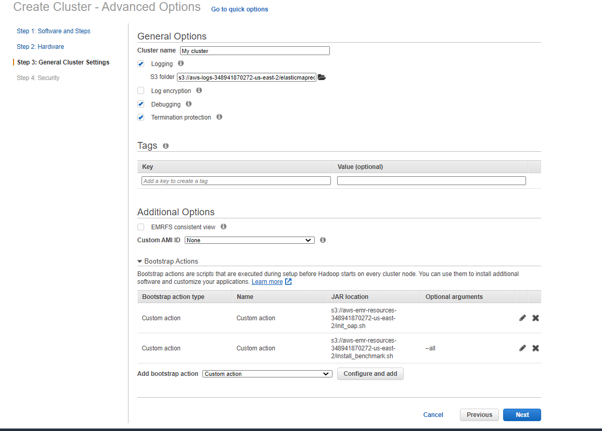

# Use OAP on Amazon EMR cloud

## 1. Upload init script 

Upload the init script **[init_oap.sh](./init_oap.sh)** and **[install_benchmark.sh](./benchmark/install_benchmark.sh)** and to S3:
    
1. Download **[init_oap.sh](./init_oap.sh)** and **[install_benchmark.sh](./benchmark/install_benchmark.sh)** to a local folder.
2. Update **[init_oap.sh](./init_oap.sh)** and **[install_benchmark.sh](./benchmark/install_benchmark.sh)** to S3.

## 2. Create a new cluster using init script and installing benchmark tools
To create a new cluster using the uploaded init script, follow the following steps:

1. Click the  **Go to advanced options** to custom your cluster;
2. **Software and Steps:** choose the release of emr and the software you need;
3. **Hardware:** choose the instance type and other configurations of hardware;
4. **General Cluster Settings:** add bootstrap action and add **[init_oap.sh](./init_oap.sh)** and **[install_benchmark.sh](./benchmark/install_benchmark.sh)** like following picture;

5. **Security:** define the permissions and other security configurations;
6. Click **Create cluster**. 

## 3. Run benchmark easily by using **[run_benchmark.sh](./benchmark/run_benchmark.sh)**

The script support to run TPC-DS, TPC-H and HiBench. And you need to add the configuration of OAP on spark-defaults.conf.

1. For HiBench:  
    Generate data: ./run_benchmark.sh -g|--gen   -w|--workload hibench -W|--hibenchWorkload [ml/kmeans|micro/terasort|..] -P|--hibenchProfile [tiny|small|large|huge|gigantic|bigdata] --Port [8020|customed hdfs port]  
    Run benchmark: ./run_benchmark.sh -r|--rerun -w|--workload hibench -W|--hibenchWorkload [ml/kmeans|micro/terasort|..] -P|--hibenchProfile [tiny|small|large|huge|gigantic|bigdata] --Port [8020|customed hdfs port]
2. For TPC-DS:  
    Generate data: ./run_benchmark.sh -g|--gen   -w|--workload tpcds -f|--format [parquet|orc] -s|--scaleFactor [10|custom the data scale,the unit is GB] -d|--doubleForDecimal -p|--partitionTables --Port [8020|customed hdfs port]   
    Run benchmark: ./run_benchmark.sh -r|--rerun -w|--workload tpcds -i|--iteration [1|custom the interation you want to run] -f|--format [parquet|orc] -s|--scaleFactor [10|custom the data scale,the unit is GB] --Port [8020|customed hdfs port]   

3. For TPC-H:  
    Generate data: ./run_benchmark.sh -g|--gen   -w|--workload tpcds -f|--format [parquet|orc] -s|--scaleFactor [10|custom the data scale,the unit is GB] -d|--doubleForDecimal -p|--partitionTables --Port [8020|customed hdfs port]  
    Run benchmark: ./run_benchmark.sh -r|--rerun -w|--workload tpch  -i|--iteration [1|custom the interation you want to run] -f|--format [parquet|orc] -s|--scaleFactor [10|custom the data scale,the unit is GB] --Port [8020|customed hdfs port] 
 