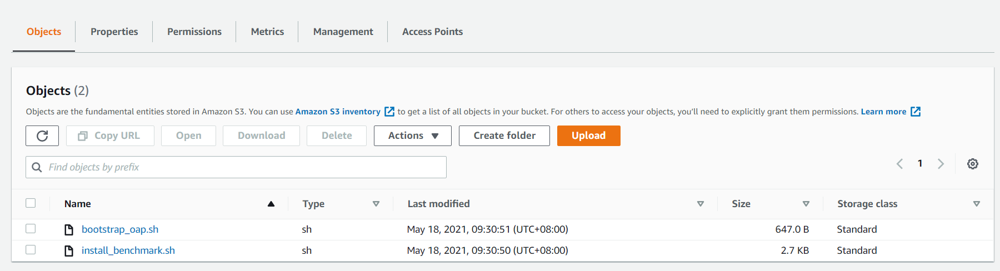
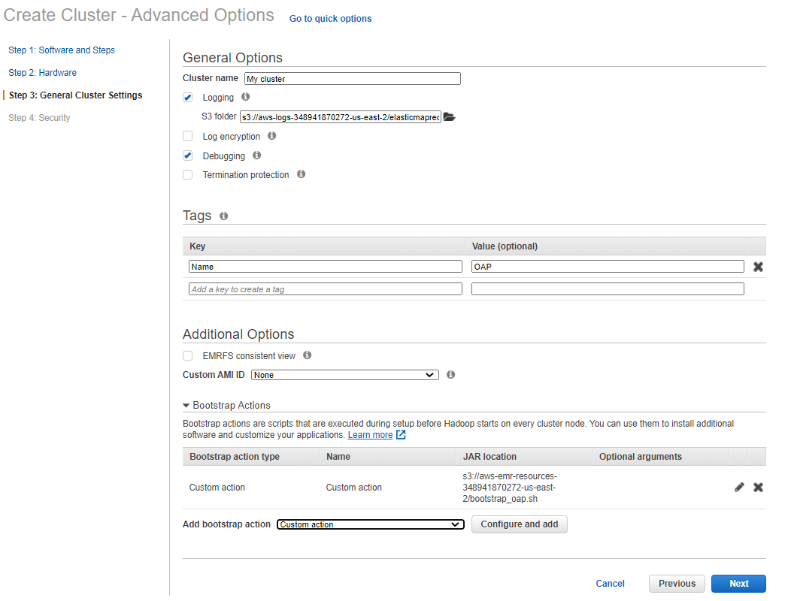
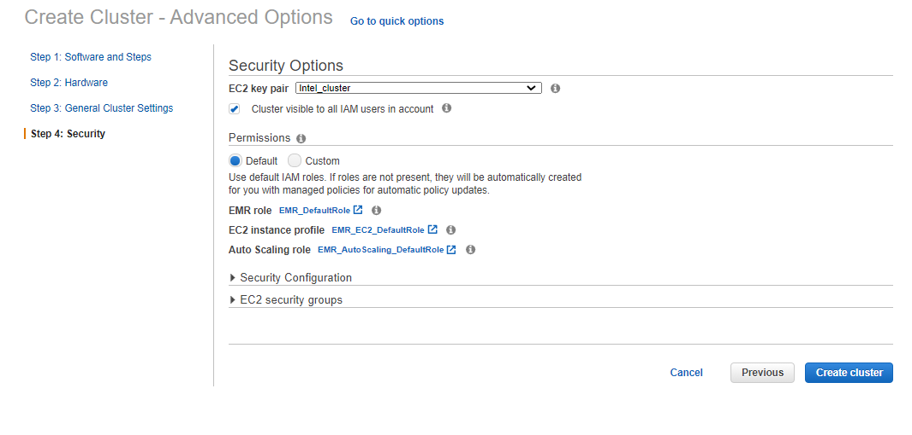

EMR-benchmark-tool is the project to easily run different workloads by providing minimum configuration parameters. It also provide the function to run workflows.

# Prerequisites

## Upload init script 

Upload the init script **[bootstrap_oap.sh](../bootstrap_oap.sh)** to S3:
    
1. Download **[bootstrap_oap.sh](../bootstrap_oap.sh)** to a local folder.
2. Update **[bootstrap_oap.sh](../bootstrap_oap.sh)** to S3.




## Create a new cluster using bootstrap script
To create a new cluster using the uploaded bootstrap script, follow the following steps:

1. Click the  **Go to advanced options** to custom your cluster.
2. **Software and Steps:** choose the release of emr and the software you need.
3. **Hardware:** choose the instance type and other configurations of hardware.
4. **General Cluster Settings:** add bootstrap action and add **[bootstrap_oap.sh](../bootstrap_oap.sh)** like following picture;

5. **Security:** define the permissions and other security configurations.
6. Click **Create cluster**. 



## Update the basic configurations for spark

Make sure the primary node has python2 installed;
If you use AWS EMR, please execute the following commands to update the basic configurations for spark:

```sudo cp /lib/spark/conf/spark-defaults.conf repo/confs/spark-oap-emr/spark/spark-defaults.conf;```

```sudo cp /lib/spark/conf/spark-defaults.conf repo/confs/spark-oap-emr/hibench/spark.conf;```


## Config Rules to Follow && Create a configuration folder ##

We organized the configurations in an inheritance hierarchy to make your own configuration as minimum as possible.

* When you run your own cluster, start from an empty conf folder. By default, your empty folder will inherit all the properties in the ```./conf``` folder. So Don't try to make changes in the ```./conf``` unless we want to make the change apply to all.

* When you have an empty folder, only add new changes for config files to the folder. Don’t copy the whole config file from ```./conf```. Instead, create an empty file and add only the values that you need change. The unchanged values will inherit from ```./conf``` folder.

* There are other conf folders in the repo which also inherit from ```./conf``` folder. 
You can inherit from the conf in repo by creating a ```.base``` file in your conf folder and put the relative path to the conf you want to inherit in the first line. 

* For example, we've created the repo ```repo/confs/spark-oap-emr```for the users who want to run tests on EMR cluster. 
Please follow prerequisites to update default configurations of spark. 
If you want to inherit all configurations of ```repo/confs/spark-oap-emr```, please create a new directory in ```./repo/confs```with a meaningful name which will act as your configuration root for your workload and update the content of ```.base```.

```
mkdir ./repo/confs/testconf
echo "../spark-oap-emr" > ./repo/confs/testconf/.base
```
* When you want to use HDFS or S3 for storage, you need to edit `./repo/confs/testconf/.base` and add content like:
```
NATIVE_SQL_ENGINE=TRUE
STORAGE=s3
S3_BUCKET={bucket_name}
```
Note: If you want to use s3 for storage, you must define S3_BUCKET; if you use hdfs for storage, you should only set STORAGE like: 
```
STORAGE=hdfs
```

# Run TPC-DS #

## Update ##

If you have made some changes in the parameter and need to reapply the parameters to the cluster configuration, such as some changes for spark, you need to edit ./repo/confs/testconf/spark/spark-defaults.conf like:
```
spark.sql.autoBroadcastJoinThreshold 31457280
spark.sql.broadcastTimeout 3600
spark.dynamicAllocation.executorIdleTimeout 7200000s
```
Then you can execute update action:

```
python benchmark/TPCDSonSparkSQL.py update ./repo/confs/testconf
```
Note: Updating step is neccessary to be executed even if you don't have any changes.
## Generate data ##

The first step to run TPC-DS is to generate data. To specify the data scale, data format you want, in the TPC-DS folder in your conf folder, create a file named ```config``` and add the scale and format value, for example:

```
scale 1
format parquet
partitionTables true
useDoubleForDecimal false
queries all
```

config to generate 1GB scale, parquet format and partitioned table. Refer to ```./conf/TPC-DS/config``` if you want to change other aspects. And then execute the below command to gen data.

```
python benchmark/TPCDSonSparkSQL.py gen_data ./repo/confs/testconf
```

## Run ##

Once the data is generated, you can execute the following command to run TPCDS queries:

```
python benchmark/TPCDSonSparkSQL.py run ./repo/confs/testconf 1
```

The third parameter above is the iteration to run.


# Run TPC-H #

## Update ##

The step of updating for TPC-H is similar to TPC-DS.

```
python benchmark/TPCHonSparkSQL.py update ./repo/confs/testconf
```
Note: Updating step is neccessary to be executed even if you don't have any changes.
## Generate data ##

To specify the data scale, data format you want, in the TPC-H folder in your conf folder, create a file named ```config``` and add the scale and format value, for example:

```
scale 1
format parquet
partition 1
queries all
partitionTables true
useDoubleForDecimal false
```

Refer to ```./conf/TPC-H/config``` if you want to change other aspects. And then execute the below command to gen data.

```
python benchmark/TPCHonSparkSQL.py update ./repo/confs/testconf
python benchmark/TPCHonSparkSQL.py gen_data ./repo/confs/testconf
```

## Run ##

After the data is generated, you can execute the following command to run TPCH queries:

```
python benchmark/TPCHonSparkSQL.py run ./repo/confs/testconf 1
```

# Run HiBench #

You need to refer to the [Hibench Guide](https://github.com/Intel-bigdata/HiBench) to learn more about HiBench.

## Update ##

If you have some changes for spark, you need to create the file ./repo/confs/hibench/spark.conf and add the parameters you want to change such as:
```
hibench.yarn.executor.num     2
hibench.yarn.executor.cores   4
```
Note: If you use HiBench scripts to submit spark job, you must define the parameter ```hibench.yarn.executor.num```

Then you can update the parameters for the cluster:

```
python benchmark/HBonSparkSQL.py update ./repo/confs/testconf
```
Note: Updating step is neccessary to be executed even if you don't have any changes.

## Generate data ##

HiBench supports various workloads such as K-means, terasort, ALS, PCA etc. And it also provide ```hibench.scale.profile``` to define the data scale for different benchmark. To specify the data scale, you need to create the file ./repo/confs/testconf/hibench/hibench.conf and edit it like:

```
hibench.scale.profile                small
```

Refer to ```./conf/hibench/hibench.conf``` if you want to change other aspects. And then execute the below command to gen data.

```
python benchmark/HBonSparkSQL.py update ./repo/confs/testconf
python benchmark/HBonSparkSQL.py gen_data ./repo/confs/testconf ml/kmeans
```
Note: ```hibench.scale.profile``` support tiny, small, large, huge, gigantic, bigdata. We also need to  input which workload we want to generate data for such as ml/kmeans, micro/terasort, ml/pca etc.

## Run ##

After the data is generated, you can execute the following command to run HiBench workload:

```
python benchmark/HBonSparkSQL.py run ./repo/confs/testconf ml/kmeans
```

# Run HiBench, TPC-DS, TPC-H with OAP

Please follow the [Gazelle_on_EMR.md](../../../../../docs/Gazelle_on_EMR.md) to run TPC-DS or TPC-H with Gazelle_plugin.

Please follow the [Intel_MLlib_on_EMR.md](../../../../../docs/Intel_MLlib_on_EMR.md) to run K-means, PAC, ALS with Intel-MLlib.

# Run workflow


## Prepare workflow  ##

There are one repo in ```./repo/workflows/``` named ```oap_release_performance_test_on_EMR``` which provide default configuration for different cases. Please create a repo  with the same structure and update the values you need.

For example: we create the  workflow floder as ```OAP_1.2_function_test``` in the floder ```./repo/workflows/```  and update ```./repo/OAP_1.2_function_test/.base``` to inherit ```./repo/workflows/oap_release_performance_test_on_EMR```
```
# In file .base
../oap_release_performance_test_on_EMR
```

## Trick release test ##

Exec:

```
python ./bin/run_workflows.py --workflows ./repo/workflows/OAP_1.2_function_test
```
