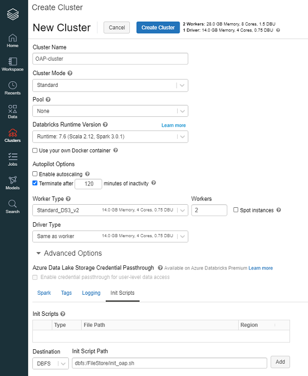

# Use OAP for Databricks Runtime

## 1. Upload init script 

Upload the init script **[init_oap.sh](./init_oap.sh)** to Databricks DBFS:
    
- Download **[init_oap.sh](./init_oap.sh)**.
- Click Data Icon in the sidebar.
- Click the DBFS button at the top of the page.
- Click the Upload button at the top of the page.
- On the Upload Data to DBFS dialog, optionally select a target directory or enter a new one.
- In the Files box, drag and drop or use the file browser to select the file **[init_oap.sh](./init_oap.sh)** to upload. 

## 2. Create a new cluster using init scripts
To use the cluster configuration page to configure a cluster to run an init script:

1. Click the  Clusters Icon in the sidebar.
2. Choose the  Databricks Runtim Version which use the spark version 3.0.1.
3. On the cluster configuration page, click the Advanced Options toggle.
4. At the bottom of the page, click the Init Scripts tab.
5. In the Destination drop-down, select a destination type. In the example in the preceding section, the destination is DBFS.
6. Specify a path to the init script. In the example in the preceding section, the path is **dbfs:/FileStore/init_oap.sh**. The path must begin with dbfs:/.
7. Click Add. 

