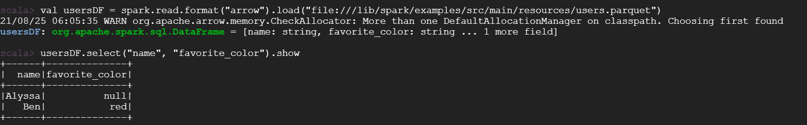

# Gazelle on GCP Dataproc 2.0

## 1. Creating a cluster on Dataproc

### 1.1 Uploading initialization actions

Upload the initialization actions scripts to Cloud Storage Buckets. 

**[bootstrap_oap.sh](../integrations/oap/dataproc/bootstrap_oap.sh)** is to help install OAP packages with conda.

**[bootstrap_benchmark.sh](../integrations/oap/dataproc/benchmark/bootstrap_benchmark.sh)** is to help install necessary tools for TPC-DS, TPC-H and HiBench on Dataproc clusters.
    
1). Download **[bootstrap_oap.sh](https://github.com/oap-project/oap-tools/blob/master/integrations/oap/dataproc/bootstrap_oap.sh)** and **[bootstrap_benchmark.sh](https://github.com/oap-project/oap-tools/blob/master/integrations/oap/dataproc/benchmark/bootstrap_benchmark.sh)** to a local folder.

2). Upload these scripts to Bucket.


### 1.2 Create a new cluster with initialization actions

To create a new cluster with initialization actions, follow the steps below:

1). Click the  **CREATE CLUSTER** to create and custom your cluster.

2). **Set up cluster:** choose cluster type and Dataproc image version ***2.0***, enable component gateway, and add Jupyter Notebook, ZooKeeper.

3). **Configure nodes:** choose the instance type and other configurations of nodes;

4). **Customize cluster:** add initialization actions as below;

5). **Manage security:** define the permissions and other security configurations;

6). Click **EQUIVALENT COMMAND LINE**, then click **RUN IN CLOUD SHELL** to add argument ` --initialization-action-timeout 60m ` to your command,
    which sets timeout period for the initialization action to 60 minutes and the default timeout value is 10 minutes. You can also set it larger if the cluster network status is not good.
    Finally press **Enter** at the end of cloud shell command line to start to create a new cluster.
    


## 2. Enabling Gazelle Plugin on Dataproc 2.0

Here is an example of `spark-defaults.conf` on a `1 master + 2 workers` on `n2-highmem-32` Dataproc cluster, with 1TB
data scale. Each worker node has 4 local SSDs attached.
you can add these items to your `/etc/spark/spark-defaults.conf` and modify config according to your cluster.

```
###Enabling Gazelle Plugin###
spark.driver.extraLibraryPath                    /opt/benchmark-tools/oap/lib
spark.executorEnv.LD_LIBRARY_PATH    /opt/benchmark-tools/oap/lib
spark.executor.extraLibraryPath              /opt/benchmark-tools/oap/lib
spark.executorEnv.CC                                /opt/benchmark-tools/oap/bin/gcc                             
spark.executorEnv.LD_PRELOAD             /usr/lib64/libjemalloc.so

spark.files   /opt/benchmark-tools/oap/oap_jars/spark-columnar-core-1.4.0-jar-with-dependencies.jar,/opt/benchmark-tools/oap/oap_jars/spark-arrow-datasource-standard-1.4.0-jar-with-dependencies.jar,/opt/benchmark-tools/oap/oap_jars/spark-sql-columnar-shims-spark311-1.4.0.jar,/opt/benchmark-tools/oap/oap_jars/spark-sql-columnar-shims-common-1.4.0.jar
spark.driver.extraClassPath  /opt/benchmark-tools/oap/oap_jars/spark-columnar-core-1.4.0-jar-with-dependencies.jar:/opt/benchmark-tools/oap/oap_jars/spark-arrow-datasource-standard-1.4.0-jar-with-dependencies.jar:/opt/benchmark-tools/oap/oap_jars/spark-sql-columnar-shims-spark311-1.4.0.jar:/opt/benchmark-tools/oap/oap_jars/spark-sql-columnar-shims-common-1.4.0.jar
spark.executor.extraClassPath /opt/benchmark-tools/oap/oap_jars/spark-columnar-core-1.4.0-jar-with-dependencies.jar:/opt/benchmark-tools/oap/oap_jars/spark-arrow-datasource-standard-1.4.0-jar-with-dependencies.jar:/opt/benchmark-tools/oap/oap_jars/spark-sql-columnar-shims-spark311-1.4.0.jar:/opt/benchmark-tools/oap/oap_jars/spark-sql-columnar-shims-common-1.4.0.jar
spark.executor.instances                         8
spark.executor.cores                             8       
spark.executor.memory                            8g
spark.memory.offHeap.enabled                     true
spark.memory.offHeap.size                        40g
spark.executor.memoryOverhead                    384
spark.sql.shuffle.partitions                     64
spark.sql.files.maxPartitionBytes                1073741824
spark.plugins                                    com.intel.oap.GazellePlugin
spark.shuffle.manager     org.apache.spark.shuffle.sort.ColumnarShuffleManager
spark.oap.sql.columnar.preferColumnar false
spark.sql.join.preferSortMergeJoin  false
spark.sql.execution.sort.spillThreshold          2147483648
spark.oap.sql.columnar.joinOptimizationLevel     18
spark.oap.sql.columnar.sortmergejoin.lazyread  true
spark.executor.extraJavaOptions   -XX:+UseParallelOldGC -XX:ParallelGCThreads=5 -XX:NewRatio=1 -XX:SurvivorRatio=1 -XX:+UseCompressedOops -verbose:gc -XX:+PrintGCDetails -XX:+PrintGCTimeStamps
spark.executorEnv.ARROW_ENABLE_NULL_CHECK_FOR_GET    false
spark.sql.autoBroadcastJoinThreshold             10m
spark.kryoserializer.buffer.max                  128m
spark.oap.sql.columnar.sortmergejoin  true
spark.oap.sql.columnar.shuffle.customizedCompression.codec  lz4
spark.sql.inMemoryColumnarStorage.batchSize      20480
spark.sql.sources.useV1SourceList avro
spark.sql.columnar.window  true
spark.sql.columnar.sort  true
spark.sql.execution.arrow.maxRecordsPerBatch     20480
spark.kryoserializer.buffer                      32m
spark.sql.parquet.columnarReaderBatchSize        20480
spark.executorEnv.MALLOC_ARENA_MAX   2
spark.executorEnv.ARROW_ENABLE_UNSAFE_MEMORY_ACCESS  true
spark.oap.sql.columnar.wholestagecodegen         true
spark.serializer org.apache.spark.serializer.KryoSerializer
spark.authenticate false
spark.executorEnv.MALLOC_CONF                    background_thread:true,dirty_decay_ms:0,muzzy_decay_ms:0,narenas:2
spark.sql.columnar.codegen.hashAggregate false
spark.yarn.appMasterEnv.LD_PRELOAD           /usr/lib64/libjemalloc.so
spark.network.timeout 3600s
spark.sql.warehouse.dir hdfs:///datagen
spark.dynamicAllocation.enabled false

```
#### Verify Gazelle Plugin Integration

Then you can read Parquet after executing command  `/lib/spark/bin/spark-shell`.

```
val usersDF = spark.read.format("arrow").load("file:///lib/spark/examples/src/main/resources/users.parquet")
usersDF.select("name", "favorite_color").show
```
The picture below is an example of a successfully run.



## 3. Run TPC-DS with notebooks

### 3.1 Generate data

You need to update the following configurations according to your request on **[tpcds_datagen.ipynb](../integrations/oap/dataproc/notebooks/tpcds_datagen_Dataproc.ipynb)**:
```
val scale = "1"                   // data scale 1GB
val format = "parquet"            // support parquet or orc file format
val partitionTables = true        // create partitioned table
val storage = "hdfs"              // support HDFS
val bucket_name = "/user/livy"    // scala notebook only has the write permission of "hdfs://user/livy" directory
val useDoubleForDecimal = false   // use double format instead of decimal format
```
Then you can use **[tpcds_datagen.ipynb](../integrations/oap/dataproc/notebooks/tpcds_datagen_Dataproc.ipynb)** to generate data.

### 3.2 Run TPC-DS power test

Here are 2 notebooks for you to easily run TPC-DS power test with Dataproc Spark or Gazelle Plugin.

Update the following configuration according to your request on **[tpcds_power_test.ipynb](../integrations/oap/dataproc/notebooks/tpcds_power_test_Dataproc.ipynb)(Dataproc spark)** or **[tpcds_power_test_with_gazelle_plugin.ipynb](../integrations/oap/dataproc/notebooks/tpcds_power_test_with_gazelle_plugin_Dataproc.ipynb)**(Gazelle_plugin):

```
val scaleFactor = "1"             // data scale 1GB
val iterations = 1                // how many times to run the whole set of queries.
val format = "parquet"            // support parquet or orc file format
val storage = "hdfs"              // support HDFS
val bucket_name = "/user/livy"    // scala notebook only has the write permission of "hdfs://user/livy" directory
val partitionTables = true        // create partition tables
val query_filter = Seq()          // Seq() == all queries
//val query_filter = Seq("q1-v2.4", "q2-v2.4") // run subset of queries
val randomizeQueries = false      // run queries in a random order. Recommended for parallel runs.
```

## 4. Run TPC-DS with benchmark tool

We also provide benchmark tool to help users quickly enable Gazelle Plugin and run benchmark with scripts.

Please refer to [Gazelle Benchmark Guide on Dataproc](../integrations/oap/dataproc/benchmark/Gazelle_on_Dataproc.md) to quickly enable Gazelle Plugin and run benchmark with benchmark tool.

