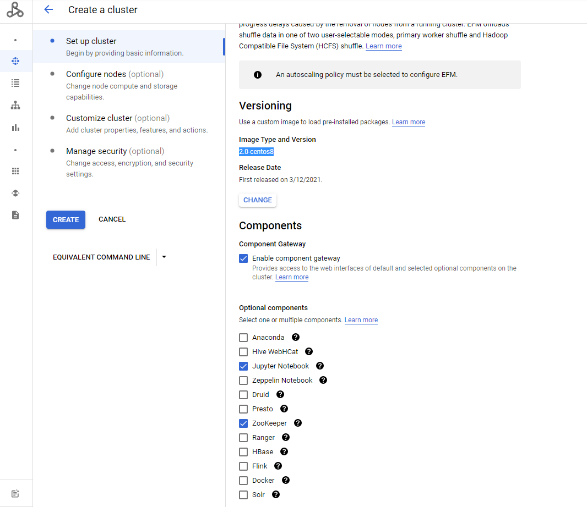
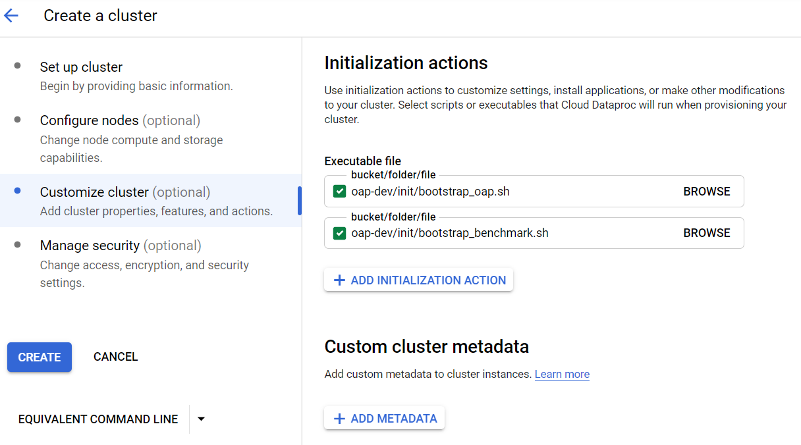

# Gazelle on GCP Dataproc 2.0

## 1. Creating a cluster on Dataproc

### 1.1 Uploading initialization actions

Upload the initialization actions scripts to Cloud Storage bucket. 
**[bootstrap_oap.sh](../integrations/oap/dataproc/bootstrap_oap.sh)** is to help conda install OAP packages and
**[install_benchmark.sh](../integrations/oap/dataproc/benchmark/install_benchmark.sh)** is to help install necessary tools for TPC-DS, TPC-H and HIBench on Dataproc clusters.
    
1). Download **[bootstrap_oap.sh](../integrations/oap/dataproc/bootstrap_oap.sh)** and **[install_benchmark.sh](../integrations/oap/dataproc/benchmark/install_benchmark.sh)** to a local folder.

2). Upload these scripts to bucket.


### 1.2 Create a new cluster with initialization actions

To create a new cluster with initialization actions, follow the steps below:

1). Click the  **CREATE CLUSTER** to create and custom your cluster.

2). **Set up cluster:** choose cluster type and Dataproc image version, enable component gateway.


3). **Configure nodes:** choose the instance type and other configurations of nodes.

4). **Customize cluster:** add initialization actions as below;


5). **Manage security:** define the permissions and other security configurations;

6). Click **Create**. 

## 2. Configurations for enabling Gazelle

### 2.1. Modifications on master

#### HDFS

Create a directory on HDFS
```
$ sudo hadoop fs -mkdir /spark-warehouse
```
Change the permission.
```
$ sudo -i
$ su hdfs
$ /usr/bin/hdfs dfs -chmod -R 777 /user
```
#### Hive

Modify `hive-site.xml`, change the default `hive.execution.engine` from `tez` to `spark`

```
 <property>
    <name>hive.execution.engine</name>
    <value>spark</value>
 </property>
```

### 2.2. Config to enable Gazelle

Modify `$SPARK_HOME/conf/spark-defaults.conf`. 
**[bootstrap_oap.sh](../integrations/oap/dataproc/bootstrap_oap.sh)** will help install all OAP packages under dir `/opt/benchmark-tools/oap`,
make sure to add below configuration to `spark-defaults.conf`.

```
spark.driver.extraLibraryPath                /opt/benchmark-tools/oap/lib
spark.executorEnv.LD_LIBRARY_PATH            /opt/benchmark-tools/oap/lib
spark.executor.extraLibraryPath              /opt/benchmark-tools/oap/lib
spark.executorEnv.LIBARROW_DIR               /opt/benchmark-tools/oap
spark.executorEnv.CC                         /opt/benchmark-tools/oap/bin/gcc
```
Then make sure use below command to add some environment variables before start Gazelle, you can also add them to `~/.bashrc`.
```
export CC=/opt/benchmark-tools/oap/bin/gcc
export LIBARROW_DIR=/opt/benchmark-tools/oap
export LD_LIBRARY_PATH=/opt/benchmark-tools/oap/lib/:$LD_LIBRARY_PATH
```


Here is an example of `spark-defaults.conf` on a `1 master + 2 workers` Dataproc cluster.

```
###Enabling Gazelle Plugin###

spark.driver.extraLibraryPath                /opt/benchmark-tools/oap/lib
spark.executorEnv.LD_LIBRARY_PATH            /opt/benchmark-tools/oap/lib
spark.executor.extraLibraryPath              /opt/benchmark-tools/oap/lib
spark.executorEnv.LIBARROW_DIR               /opt/benchmark-tools/oap
spark.executorEnv.CC                         /opt/benchmark-tools/oap/bin/gcc

spark.sql.extensions  com.intel.oap.ColumnarPlugin
spark.files   /opt/benchmark-tools/oap/oap_jars/spark-columnar-core-<version>-jar-with-dependencies.jar,/opt/benchmark-tools/oap/oap_jars/spark-arrow-datasource-standard-<version>-jar-with-dependencies.jar
spark.driver.extraClassPath  /opt/benchmark-tools/oap/oap_jars/spark-columnar-core-<version>-jar-with-dependencies.jar:/opt/benchmark-tools/oap/oap_jars/spark-arrow-datasource-standard-<version>-jar-with-dependencies.jar
spark.executor.extraClassPath  /opt/benchmark-tools/oap/oap_jars/spark-columnar-core-<version>-jar-with-dependencies.jar:/opt/benchmark-tools/oap/oap_jars/spark-arrow-datasource-standard-<version>-jar-with-dependencies.jar

spark.master yarn
spark.deploy-mode client
spark.executor.instances 4
spark.executor.cores 2
spark.executor.memory 4g
spark.executor.memoryOverhead 2989
spark.memory.offHeap.enabled false
spark.memory.offHeap.size 3g
spark.driver.memory 2g
spark.driver.maxResultSize  3g

spark.shuffle.manager     org.apache.spark.shuffle.sort.ColumnarShuffleManager
spark.oap.sql.columnar.sortmergejoin  true
spark.oap.sql.columnar.preferColumnar true
spark.oap.sql.columnar.joinOptimizationLevel 12

spark.sql.warehouse.dir hdfs://cluster-dev-m/spark-warehouse
spark.sql.autoBroadcastJoinThreshold 31457280
spark.sql.adaptive.enabled true
spark.sql.inMemoryColumnarStorage.batchSize 20480
spark.sql.sources.useV1SourceList avro
spark.sql.extensions com.intel.oap.ColumnarPlugin
spark.sql.columnar.window  true
spark.sql.columnar.sort  true
spark.sql.execution.arrow.maxRecordsPerBatch 20480
spark.sql.shuffle.partitions  72
spark.sql.parquet.columnarReaderBatchSize 20480
spark.sql.columnar.codegen.hashAggregate false
spark.sql.join.preferSortMergeJoin  false
spark.sql.broadcastTimeout 3600

spark.authenticate false
spark.history.ui.port 18080
spark.history.fs.cleaner.enabled true
spark.eventLog.enabled true
spark.network.timeout 3600s
spark.serializer org.apache.spark.serializer.KryoSerializer
spark.kryoserializer.buffer           64m
spark.kryoserializer.buffer.max       256m
spark.dynamicAllocation.executorIdleTimeout 3600s

```

## 3. Run TPC-DS

We provide scripts **[run_benchmark.sh](../integrations/oap/dataproc/benchmark/run_benchmark.sh)** to help easily run TPC-DS and TPC-H.

```
Generate data: ./run_benchmark.sh -g|--gen   -w|--workload tpcds -f|--format [parquet|orc] -s|--scaleFactor [10|custom the data scale,the unit is GB] -d|--doubleForDecimal -p|--partitionTables --Port [8020|customed hdfs port]   
Run benchmark: ./run_benchmark.sh -r|--rerun -w|--workload tpcds -f|--format [parquet|orc|arrow] -i|--iteration [1|custom the interation you want to run]  -s|--scaleFactor [10|custom the data scale,the unit is GB]  -p|--partitionTables --Port [8020|customed hdfs port]   
```

Only after enabling Gazelle Plugin can you run TPC-DS or TPC-H with arrow format.

Example: generate 1GB Parquet, then run TPC-DS all queries with Gazelle enabled.

```
# generate data
./run_benchmark.sh -g -w tpcds -f parquet  -s 1 -d -p --Port 8020

# run TPC-DS
./run_benchmark.sh -r -w tpcds -f arrow -s 1 -i 1 -p --Port  8020
```

### 4. Run TPC-H:  
```
Generate data: ./run_benchmark.sh -g|--gen   -w|--workload tpch  -f|--format [parquet|orc] -s|--scaleFactor [10|custom the data scale,the unit is GB] -d|--doubleForDecimal -p|--partitionTables --Port [8020|customed hdfs port]  
Run benchmark: ./run_benchmark.sh -r|--rerun -w|--workload tpch  -f|--format [parquet|orc|arrow] -i|--iteration [1|custom the interation you want to run] -s|--scaleFactor [10|custom the data scale,the unit is GB] -p|--partitionTables --Port [8020|customed hdfs port] 
``` 
