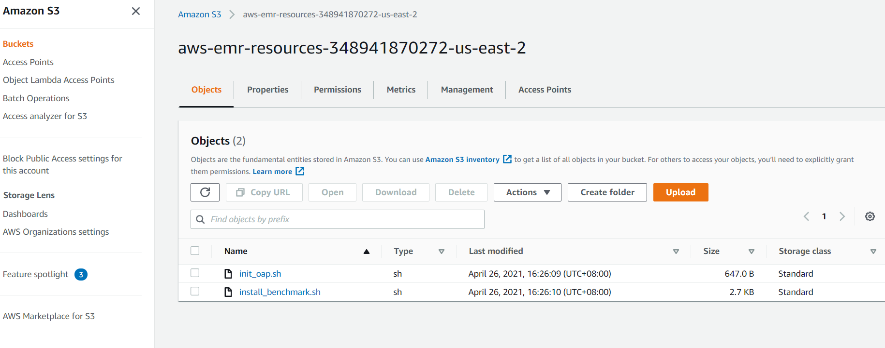

# Gazelle on EMR 6.3.0

## 1. Creating a cluster on EMR

### 1.1 Uploading initialization actions

Upload the initialization actions scripts to S3. 
**[bootstrap_oap.sh](../dev/integrations/oap/emr/bootstrap_oap.sh)** is to help conda install OAP packages and
**[install_benchmark.sh](../dev/integrations/oap/emr/benchmark/install_benchmark.sh)** is to help install necessary tools for TPC-DS, TPC-H and HIBench on EMR clusters.
    
1). Download **[bootstrap_oap.sh](../dev/integrations/oap/emr/bootstrap_oap.sh)** and **[install_benchmark.sh](../dev/integrations/oap/emr/benchmark/install_benchmark.sh)** to a local folder.

2). Upload these scripts to S3.




### 1.2 Create a new cluster using bootstrap script

To create a new cluster with initialization actions, follow the steps below:

1). Click the  **Go to advanced options** to custom your cluster.

2). **Software and Steps:** choose the release of emr and the software you need.

3). **Hardware:** choose the instance type and other configurations of hardware;

4). **General Cluster Settings:** add bootstrap action and add **[bootstrap_oap.sh](../dev/integrations/oap/emr/bootstrap_oap.sh)** like following picture;


5). **Security:** define the permissions and other security configurations.

6). Click **Create cluster**. 

## 2. Using benchmark-tools to easily run TPC-DS with Gazelle

You can refer to [benchmark-tool Guide](../dev/integrations/oap/emr/emr-benchmark-tool/README.md) to learn how to use this tool. We switch working directory at ```../dev/integrations/oap/emr/emr-benchmark-tool``` and follow next steps.

### 2.1. Update the basic configuration of spark

#### Update the basic configuration of spark
```
$ sudo cp /lib/spark/conf/spark-defaults.conf ./repo/confs/spark-oap-emr/spark/spark-defaults.conf;
```

### 2.2. Create the testing repo && Config gazelle_plugin

#### Create the testing repo
```
mkdir ./repo/confs/gazella_plugin_performance
```
#### Update the content of .base to inherit the configuration of ./repo/confs/spark-oap-emr
```
echo "../spark-oap-emr" > ./repo/confs/gazella_plugin_performance/.base
```
#### Update the content of ./repo/confs/gazella_plugin_performance/env.conf
```
NATIVE_SQL_ENGINE=TRUE
STORAGE=s3
S3_BUCKET={bucket_name}
```
Note: If you want to use s3 for storage, you must define S3_BUCKET; if you use hdfs for storage, you should set STORAGE like ```STORAGE=hdfs```

#### Update the configurations of spark
**[bootstrap_oap.sh](../dev/integrations/oap/emr/bootstrap_oap.sh)** will help install all OAP packages under dir `/opt/benchmark-tools/oap`,
make sure to add below configuration to `./repo/confs/gazella_plugin_performance/spark/spark-defaults.conf`.

```
++spark.driver.extraLibraryPath   :/opt/benchmark-tools/oap/lib
++spark.driver.extraClassPath     :/opt/benchmark-tools/oap/oap_jars/spark-arrow-datasource-standard-<oap.version>-jar-with-dependencies.jar:/opt/benchmark-tools/oap/oap_jars/spark-columnar-core-<oap.version>-jar-with-dependencies.jar

++spark.executor.extraLibraryPath :/opt/benchmark-tools/oap/lib
++spark.executor.extraClassPath   :/opt/benchmark-tools/oap/oap_jars/spark-arrow-datasource-standard-<oap.version>-with-dependencies.jar:/opt/benchmark-tools/oap/oap_jars/spark-columnar-core-<oap.version>-jar-with-dependencies.jar

spark.executor.defaultJavaOptions -verbose:gc -XX:+PrintGCDetails -XX:+PrintGCDateStamps -XX:OnOutOfMemoryError='kill -9 %p' -XX:MaxDirectMemorySize=40G
spark.executorEnv.CC                            /opt/benchmark-tools/oap/bin/gcc
spark.executorEnv.CXX                           /opt/benchmark-tools/oap/bin/g++
spark.executorEnv.CPLUS_INCLUDE_PATH            /opt/benchmark-tools/oap/include
spark.executorEnv.LD_LIBRARY_PATH               /opt/benchmark-tools/oap/lib
spark.sql.extensions                            com.intel.oap.ColumnarPlugin
spark.shuffle.manager                           org.apache.spark.shuffle.sort.ColumnarShuffleManager
spark.sql.join.preferSortMergeJoin              false
spark.sql.inMemoryColumnarStorage.batchSize     20480
spark.sql.parquet.columnarReaderBatchSize       20480
spark.sql.execution.arrow.maxRecordsPerBatch    20480
spark.executor.memoryOverhead                   512m
spark.sql.autoBroadcastJoinThreshold            10485760
spark.driver.maxResultSize                      1g
spark.sql.shuffle.partitions                    200
spark.memory.offHeap.enabled                    false
spark.memory.offHeap.size                       10g
spark.sql.adaptive.enabled                      false
spark.sql.sources.useV1SourceList               avro
spark.driver.userClassPathFirst                 true
spark.executor.userClassPathFirst               true

```

#### Define te the configurations of TPC-DS

Edit the content of `./repo/confs/gazella_plugin_performance/TPC-DS/config`
```
scale 1                    // data scale/GB
format parquet             // support parquet or orc
partitionTables true       // creating partitioned tables
queries all                // 'all' means running 99 queries, '1,2,4,6' means running q1.sql, q2.sql, q4.sql, q6.sql
```

#### Define te the configurations of TPC-H

Edit the content of `./repo/confs/gazella_plugin_performance/TPC-H/config`
```
scale 1                    // data scale 1 GB
format parquet             // support parquet or orc
partitionTables true       // creating partitioned tables
queries all                // 'all' means running 22 queries, '1,2,4,6' means running 1.sql, 2.sql, 4.sql, 6.sql
```


## 3. Run TPC-DS

We provide scripts **[run_benchmark.sh](../dev/integrations/oap/dataproc/benchmark/run_benchmark.sh)** to help easily run TPC-DS and TPC-H.

```
Generate data: ./run_benchmark.sh -g|--gen   -w|--workload tpcds -f|--format [parquet|orc] -s|--scaleFactor [10|custom the data scale,the unit is GB] -d|--doubleForDecimal -p|--partitionTables --Port [8020|customed hdfs port]   
Run benchmark: ./run_benchmark.sh -r|--rerun -w|--workload tpcds -f|--format [parquet|orc|arrow] -i|--iteration [1|custom the interation you want to run]  -s|--scaleFactor [10|custom the data scale,the unit is GB]  -p|--partitionTables --Port [8020|customed hdfs port]   
```

Only after enabling Gazelle Plugin can you run TPC-DS or TPC-H with arrow format.

Example: generate 1GB Parquet, then run TPC-DS all queries with Gazelle enabled.

```
# generate data
./run_benchmark.sh -g -w tpcds -f parquet  -s 1 -d -p --Port 8020

# run TPC-DS
./run_benchmark.sh -r -w tpcds -f arrow -s 1 -i 1 -p --Port  8020
```

### 4. Run TPC-H:  
```
Generate data: ./run_benchmark.sh -g|--gen   -w|--workload tpch  -f|--format [parquet|orc] -s|--scaleFactor [10|custom the data scale,the unit is GB] -d|--doubleForDecimal -p|--partitionTables --Port [8020|customed hdfs port]  
Run benchmark: ./run_benchmark.sh -r|--rerun -w|--workload tpch  -f|--format [parquet|orc|arrow] -i|--iteration [1|custom the interation you want to run] -s|--scaleFactor [10|custom the data scale,the unit is GB] -p|--partitionTables --Port [8020|customed hdfs port] 
``` 
