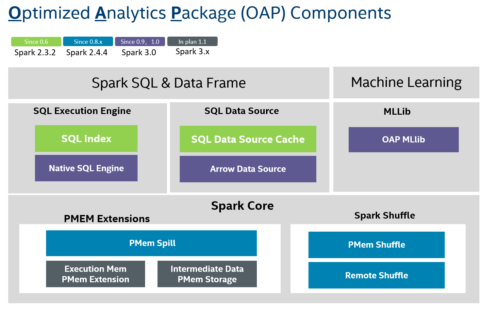

# OAP Project Overview

Optimized Analytics Package (OAP) for Spark platform is a open source project for multiple Spark optimizations and features driving by Intel and the community.
Spark is powerful and well optimized in a lot of aspects.  But we still face a few challenges for Spark to the next level performance.

- The JVM and row-based computing engine preventing Spark to be fully optimized for Intel hardware, for example AVX/AVX512, GPU

- The current implementation of key aspects, such as memory management & shuffle didn’t consider the latest technology advancements,  like PMEM

- The batch processing engine a lot of times cannot satisfy the need of queries with high performance requirement.

OAP Project is targeted to optimize Spark in these aspects above, now it has 8 components including SQL DS Cache,
Native SQL Engine, Arrow Data Source, OAP MLlib, PMem Spill, PMem Common, PMem Shuffle and Remote Shuffle.

## Guide

Please refer to the total OAP project installation and development guide below.

* [OAP Installation Guide](./OAP-Installation-Guide.md)
* [OAP Developer Guide](./OAP-Developer-Guide.md)

You can get more detailed information from each module web page of OAP Project below, or from the left sidebar navigation.

* [SQL DS Cache](https://oap-project.github.io/sql-ds-cache/)
* [Native SQL Engine](https://oap-project.github.io/native-sql-engine/)
* [Arrow Data Source](https://oap-project.github.io/arrow-data-source/)
* [OAP MLlib](https://oap-project.github.io/oap-mllib/)
* [PMem Shuffle](https://oap-project.github.io/pmem-shuffle/)
* [Remote Shuffle](https://oap-project.github.io/remote-shuffle/)
* [PMem Spill](https://oap-project.github.io/pmem-spill/)
* [PMem Common](https://oap-project.github.io/pmem-common/)
