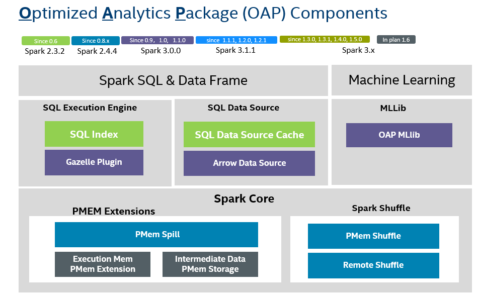

 

Optimized Analytics Package (OAP) is an open source project to optimize Apache Spark on Cache, Shuffle, Native SQL Engine, MLlib and so on, driven by Intel and the community.

# <b>Why use OAP?</b>

Apache Spark is powerful and well optimized on many aspects, but still faces some challenges to achieve the higher-level performance.

- The JVM and row-based computing engine prevents Spark to be fully optimized for Intel hardware, for example AVX/AVX512, GPU

- The current implementation of key aspects, such as memory management & shuffle, doesn't consider the latest technology advancements,  like PMEM

- The batch processing engine cannot satisfy the need of queries with high performance requirement.

OAP Project is targeted to optimize Spark on these aspects above, now it has 8 components, including **SQL DS Cache**,
**Native SQL Engine**, **Arrow Data Source**, **OAP MLlib**, **PMem Spill**, **PMem Common**, **PMem Shuffle** and **Remote Shuffle**.

# <b>How to use OAP?</b>

## Guide

Please refer to the total OAP project installation and developer guide below.

* [OAP Installation Guide](./OAP-Installation-Guide.md)
* [OAP Developer Guide](./OAP-Developer-Guide.md)

## Components

You can get more detailed information from each module web page of OAP Project below.

* [SQL DS Cache](https://oap-project.github.io/sql-ds-cache/)
* [Native SQL Engine](https://oap-project.github.io/native-sql-engine/)
* [OAP MLlib](https://oap-project.github.io/oap-mllib/)
* [PMem Shuffle](https://oap-project.github.io/pmem-shuffle/)
* [Remote Shuffle](https://oap-project.github.io/remote-shuffle/)
* [PMem Spill](https://oap-project.github.io/pmem-spill/)
* [PMem Common](https://oap-project.github.io/pmem-common/)
