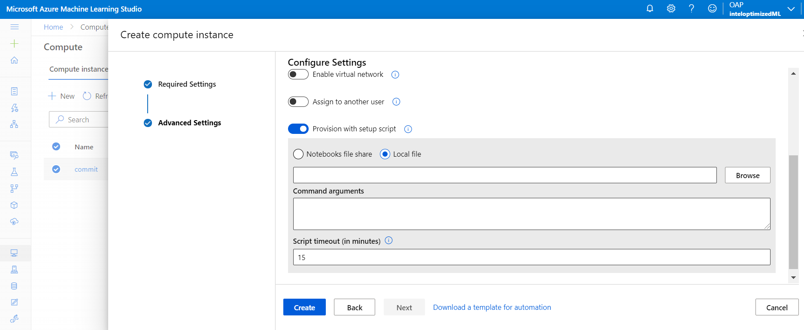

# Intel-Optimized Machine Learning libraries on Azure Machine Learning

## Intel-Optimized TensorFlow

This document will introduce how to use Intel-optimized TensorFlow on Azure Machine Learning to speed up training and inference performance compared with Stock TensorFlow.

Please follow the steps below to install Intel-Optimized TensorFlow on Azure Machine Learning Studio, here we take a single compute instance as an example, you can also to create a multi-nodes cluster.

### Create Compute Instance with Init Script

Choose the **Create new** button on Home page of Azure Machine Learning Studio to create a compute instance.

In the **Required Settings** page, configure required settings, like `Virtual machine size`, we recommend use `Standard_F32s_v2` or above.

In the **Advanced Settings** page, enable **Provision with setup scripts** button and choose **Local file** [init script](https://raw.githubusercontent.com/oap-project/oap-tools/master/integrations/ml/azure/init_intel_optimized_ml.sh) which you have already downloaded to the local like below picture.  

Finally click **Create** button.

### Run benchmark notebooks for performance comparison

We have provided Bert-Large [inference](./benchmark/benchmark_tensorflow_bertlarge_inference.ipynb) and [training](./benchmark/benchmark_tensorflow_bertlarge_training.ipynb) notebooks.

Download the Bert-Large [inference](https://raw.githubusercontent.com/oap-project/oap-tools/master/integrations/ml/azure/benchmark/benchmark_tensorflow_bertlarge_inference.ipynb) and [training](https://raw.githubusercontent.com/oap-project/oap-tools/master/integrations/ml/azure/benchmark/benchmark_tensorflow_bertlarge_training.ipynb) notebooks to instances.

Open the **JupyterLab** application, and choose **Python 3.8 - Tensorflow** kernel and run benchmark notebooks to get Intel-Optimized inference or training performance. 

Then you can set up a pure compute instance without init script to use Stock TensorFlow, select **Python 3.8 - Tensorflow** kernel and run benchmark notebooks to get stock performance for comparison.  
