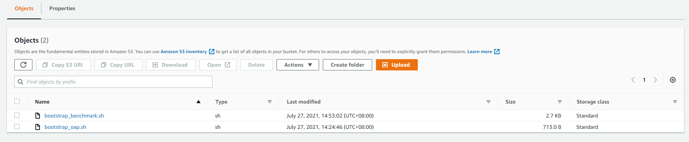
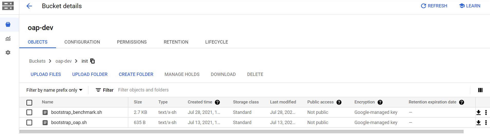

# Running Benchmark Automation on Cloud with OAP

This guide helps run different workloads easily on Cloud Platforms. It also provides the function to run workflow.

## 1. Create a new cluster on Cloud

### 1.1 AWS EMR

If you are using AWS EMR, you can refer [OAP integrate EMR](../emr/README.md) to create a new cluster. To run benchmark on EMR cluster with OAP, you also need to upload both **[bootstrap_benchmark.sh](https://raw.githubusercontent.com/oap-project/oap-tools/branch-1.2/integrations/oap/emr/benchmark/bootstrap_benchmark.sh)** and **[bootstrap_oap.sh](https://raw.githubusercontent.com/oap-project/oap-tools/branch-1.2/integrations/oap/emr/bootstrap_oap.sh)** to S3 and add extra bootstrap action to execute **[bootstrap_benchmark.sh](https://raw.githubusercontent.com/oap-project/oap-tools/branch-1.2/integrations/oap/emr/benchmark/bootstrap_benchmark.sh)** and **[bootstrap_oap.sh](https://raw.githubusercontent.com/oap-project/oap-tools/branch-1.2/integrations/oap/emr/bootstrap_oap.sh)** when creating a new cluster.



 

### 1.2 Google Cloud Dataproc

If you are using Google Cloud Dataproc, please refer to [OAP on Dataproc](../dataproc/README.md) to create a new cluster.
To run benchmark on Dataproc cluster, you also need to upload **[bootstrap_benchmark.sh](../dataproc/benchmark/bootstrap_benchmark.sh)** to bucket 
then add initialization actions **[bootstrap_benchmark.sh](../emr/benchmark/bootstrap_benchmark.sh)** as below when creating a new cluster.



 


## 2. Update the basic configurations for Spark

### AWS EMR

Make sure the primary node has python2 installed;
If you use AWS EMR, please execute the following commands to update the basic configurations for spark:

```
git clone https://github.com/oap-project/oap-tools.git
cd oap-tools/integrations/oap/benchmark-tool/
sudo cp /lib/spark/conf/spark-defaults.conf repo/confs/spark-oap-emr/spark/spark-defaults.conf
sudo cp /lib/spark/conf/spark-defaults.conf repo/confs/spark-oap-emr/hibench/spark.conf
```

### Google Cloud Dataproc

Run below the command to change the owner of directory`/opt/benchmark-tools`:

```
sudo chown $(whoami):$(whoami) -R /opt/benchmark-tools
```

Run the following commands to update the basic configurations for Spark:

```
git clone https://github.com/oap-project/oap-tools.git
cd oap-tools/integrations/oap/benchmark-tool/
sudo cp /lib/spark/conf/spark-defaults.conf repo/confs/spark-oap-dataproc/spark/spark-defaults.conf
sudo cp /lib/spark/conf/spark-defaults.conf repo/confs/spark-oap-dataproc/hibench/spark.conf
```

## 3. Config Rules to Follow && Create a configuration folder ##

We organized the configurations in an inheritance hierarchy to make your own configuration as minimum as possible.

* When you run your own cluster, start from an empty conf folder. By default, your empty folder will inherit all the properties in the ```./conf``` folder. So Don't try to make changes in the ```./conf``` unless we want to make the change apply to all.

* When you have an empty folder, only add new changes for config files to the folder. Don’t copy the whole config file from ```./conf```. Instead, create an empty file and add only the values that you need change. The unchanged values will inherit from ```./conf``` folder.

* There are other conf folders in the repo which also inherit from ```./conf``` folder. 
You can inherit from the conf in repo by creating a ```.base``` file in your conf folder and put the relative path to the conf you want to inherit in the first line. 

* For example, we've created the repo ```repo/confs/spark-oap-emr```for the users who want to run tests on EMR cluster. 
Please follow prerequisites to update default configurations of spark. 
If you want to inherit all configurations of ```repo/confs/spark-oap-emr```, please create a new directory in ```./repo/confs```with a meaningful name which will act as your configuration root for your workload and update the content of ```.base```.

### 3.1 `.base`

```
mkdir ./repo/confs/testconf

#####if on EMR, then 
echo "../spark-oap-emr" > ./repo/confs/testconf/.base

#####if on Dataproc, then
echo "../spark-oap-dataproc" > ./repo/confs/testconf/.base
```

### 3.2 `env.conf`

#### AWS EMR

* When you want to use HDFS or S3 for storage, you need to edit `./repo/confs/testconf/env.conf` and add content like:
```
STORAGE=s3
BUCKET={bucket_name}
```
Note: If you want to use s3 for storage, you must define BUCKET; if you use hdfs for storage, you should only set STORAGE like: 
```
STORAGE=hdfs
```

#### Google Could Dataproc

edit `./repo/confs/testconf/env.conf`, add below item to set HDFS as storage.

```
STORAGE=hdfs
```

If you want to use gs(Google Cloud Storage) for storage, you must define BUCKET, so add below items to `./repo/confs/testconf/env.conf`
```
STORAGE=gs
BUCKET={bucket_name}
```

## 4. Run TPC-DS #

### 4.1 Modify Spark and TPC-DS configuration ###

#### Update Spark configuration ####

```
mkdir ./repo/confs/testconf/spark
touch ./repo/confs/testconf/spark/spark-defaults.conf
```
##### Google Could Dataproc

If using HDFS as storage on Dataproc, run
```
echo "spark.sql.warehouse.dir=hdfs:///datagen" >> ./repo/confs/testconf/spark/spark-defaults.conf
```
If using Google Gloud Storage as storage on Dataproc, change the following command with your bucket name, then run:
```
echo "spark.sql.warehouse.dir=gs://<your_bucket>" >> ./repo/confs/testconf/spark/spark-defaults.conf
```
#### Update TPC-DS configuration ####

The first step to run TPC-DS is to generate data. To specify the data scale, data format you want, in the TPC-DS folder in your conf folder, create a file named ```config``` :
```
mkdir repo/confs/testconf/TPC-DS
vim repo/confs/testconf/TPC-DS/config
```
and add the scale and format value, such as below:

```
scale 1
format parquet
partitionTables true
useDoubleForDecimal false
queries all
```
This configuration is to generate 1GB scale, parquet format and partitioned table. Refer to ```./conf/TPC-DS/config``` if you want to change other aspects. 

#### 4.2 Generate data ####

To make the configuration above to be valid, run the following command (Note: every time you change the Spark and TPC-DS configuration above, make sure to re-run this command.)

```
bash bin/tpc_ds.sh update ./repo/confs/testconf
```

Generate data:
```
bash bin/tpc_ds.sh gen_data ./repo/confs/testconf
```

### 4.3 Run ###

Once the data is generated, you can execute the following command to run TPC-DS queries:

```
bash bin/tpc_ds.sh run ./repo/confs/testconf 1
```

The 3rd parameter `1` means the how many times the workload will be run.


## 5. Run TPC-H on EMR ##

### 5.1 Modify Spark and TPC-H configuration ###

#### Update Spark configuration ####
```
mkdir ./repo/confs/testconf/spark
touch ./repo/confs/testconf/spark/spark-defaults.conf

```
#### Update TPC-H configuration ####

```
mkdir ./repo/confs/testconf/TPC-H
vim ./repo/confs/testconf/TPC-H/config
```

To specify the data scale, data format you want, in the TPC-H folder in your conf folder, create a file named ```config``` and add the scale and format value, for example:

```
scale 1
format parquet
partition 1
queries all
partitionTables true
useDoubleForDecimal false
```

### 5.2 Generate data ###

To make the configuration above to be valid, run the following command (Note: every time you change the configuration above, make sure to re-run this command.)

```
bash bin/tpc_h.sh update ./repo/confs/testconf
```
Generate data:

```
bash bin/tpc_h.sh gen_data ./repo/confs/testconf
```

Refer to ```./conf/TPC-H/config``` if you want to change other items.

### 5.3 Run ###

After the data is generated, you can execute the following command to run TPC-H queries:

```
bash bin/tpc_h.sh run ./repo/confs/testconf 1
```

## 6. Run HiBench ##

### 6.1 Update ###

```
mkdir ./repo/confs/testconf/hibench
vim ./repo/confs/testconf/hibench/spark.conf
```
If you have some changes for Spark, you need to create the file `./repo/confs/testconf/hibench/spark.conf` and add the parameters you want to change such as:
```
hibench.yarn.executor.num     2
hibench.yarn.executor.cores   4
```
Note: If you use HiBench scripts to submit spark job, you must define the parameter ```hibench.yarn.executor.num```

Then you can update the parameters for the cluster:

```
bash bin/hibench.sh update ./repo/confs/testconf
```
Note: Updating step is necessary to be executed even if you don't have any changes.

### 6.2 Generate data ###

HiBench supports various workloads such as K-means, terasort, ALS, PCA etc. And it also provide ```hibench.scale.profile``` to define the data scale for different benchmark. To specify the data scale, you need to create the file `./repo/confs/testconf/hibench/hibench.conf` and edit it like:

```
hibench.scale.profile                small
```

Refer to ```./conf/hibench/hibench.conf``` if you want to change other aspects. And then execute the below command to gen data.

```
bash bin/hibench.sh update ./repo/confs/testconf
bash bin/hibench.sh gen_data ./repo/confs/testconf ml/kmeans
```
Note: ```hibench.scale.profile``` support tiny, small, large, huge, gigantic, bigdata. We also need to  input which workload we want to generate data for such as ml/kmeans, micro/terasort, ml/pca etc.

### 6.3 Run ###

After the data is generated, you can execute the following command to run HiBench workload:

```
bash bin/hibench.sh run ./repo/confs/testconf ml/kmeans
```

Please refer to the [Hibench Guide](https://github.com/Intel-bigdata/HiBench) to learn more about HiBench.

## 7. Run HiBench, TPC-DS, TPC-H with OAP

Please follow [Gazelle on EMR](../emr/benchmark/Gazelle_on_EMR.md) or [Gazelle on Dataproc](../dataproc/benchmark/Gazelle_on_Dataproc.md) to run TPC-DS or TPC-H with Gazelle_plugin.

Please follow [SQL-DS-Cache_on Dataproc](../dataproc/benchmark/SQL_DS_Cache_on_Dataproc.md) to run TPC-DS with SQL DS Cache.

Please follow [Intel MLlib on EMR](../emr/benchmark/Intel_MLlib_on_EMR.md) or [OAP MLlib on Dataproc](../dataproc/benchmark/OAP_MLlib_on_Dataproc.md)to run K-means, PAC, ALS with OAP MLlib.


## 8. Run workflow ##


### 8.1 Prepare workflow  ###

There are one repo in ```./repo/workflows/``` named ```oap_release_performance_test_on_EMR``` which provide default configuration for different cases. Please create a repo  with the same structure and update the values you need.

For example: we create the workflow directory as ```OAP_1.2_function_test``` in the directory ```./repo/workflows/```  and update ```./repo/OAP_1.2_function_test/.base``` to inherit ```./repo/workflows/oap_release_performance_test_on_EMR```
```
# In file .base
../oap_release_performance_test_on_EMR
```

### 8.2 Trick release test ###

Exec:

```
python ./bin/run_workflows.py --workflows ./repo/workflows/OAP_1.2_function_test
```
