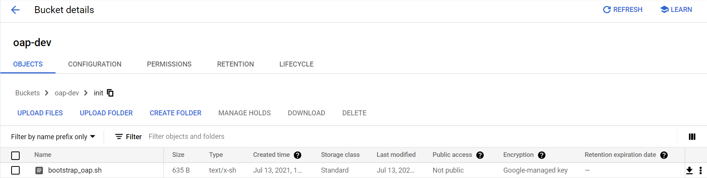
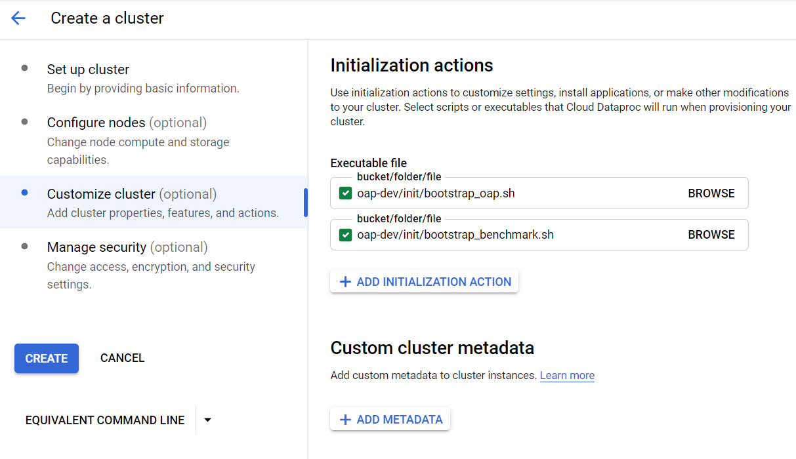

# Use OAP on Google Cloud Dataproc

## 1. Initialization actions

Upload the initialization actions script **[bootstrap_oap.sh](./bootstrap_oap.sh)** to Cloud Storage staging bucket:
    
1. Download **[bootstrap_oap.sh](./bootstrap_oap.sh)** to a local folder.
2. Upload **[bootstrap_oap.sh](./bootstrap_oap.sh)** to bucket.

## 2. Create a new cluster using bootstrap script
To create a new cluster with initialization actions, follow the steps below:

1). Click the  **CREATE CLUSTER** to create and custom your cluster.

2). **Set up cluster:** choose cluster type and Dataproc image version, enable component gateway.

3). **Configure nodes:** choose the instance type and other configurations of nodes.

4). **Customize cluster:** add initialization actions as below;

5). **Manage security:** define the permissions and other security configurations;

6). Click **Create**. 

## 3.Enable OAP features

After bootstrap action, you have successfully installed OAP binary on Dataproc Cluster nodes. 
If you want to use OAP feature, you still need to change some configuration of Spark.

Please refer to [Gazelle_on_Dataproc](./benchmark/Gazelle_Benchmark_on_Dataproc.md) to quickly enable Gazelle Plugin.

Please refer to [SQL_DS_Cache_on_Dataproc](./benchmark/SQL_DS_Cache_on_Dataproc.md) to quickly enable SQL DS Cache.

## 4. Run various workloads easily by benchmark-tool

Please refer to the [Benchmark tool User Guide](../benchmark-tool/README.md) to learn how to use benchmark-tool to easily run TPC-DS, TPC-H and HiBench with OAP.
