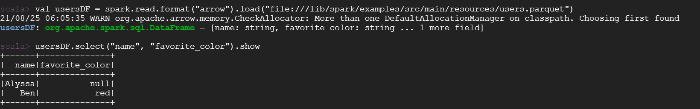

# Use OAP on Google Cloud Dataproc

## 1. Initialization actions

Upload the initialization actions script **[bootstrap_oap.sh](./bootstrap_oap.sh)** to Cloud Storage staging bucket:
    
1. Download **[bootstrap_oap.sh](https://raw.githubusercontent.com/oap-project/oap-tools/master/integrations/oap/dataproc/bootstrap_oap.sh)** to a local folder.
2. Upload **[bootstrap_oap.sh](./bootstrap_oap.sh)** to bucket.


## 2. Create a new cluster using bootstrap script

To create a new cluster with initialization actions, follow the steps below:

1). Click the  **CREATE CLUSTER** to create and custom your cluster.

2). **Set up cluster:** choose cluster type and Dataproc image version `2.0-centos8`, enable component gateway, and add Jupyter Notebook, ZooKeeper.


3). **Configure nodes:** choose the instance type and other configurations of nodes.

4). **Customize cluster:** add initialization actions as below;


5). **Manage security:** define the permissions and other security configurations;

6). Click **EQUIVALENT COMMAND LINE**, then click **RUN IN CLOUD SHELL** to add argument ` --initialization-action-timeout 60m ` to your command,
which sets timeout period for the initialization action to 60 minutes and the default timeout value is 10 minutes. You can also set it larger if the cluster network status is not good.
Finally press **Enter** at the end of cloud shell command line to start to create a new cluster.


## 3. Enable OAP features

After creating a cluster with initialization actions, you have successfully installed OAP binary on Dataproc cluster nodes. 
To use OAP feature, you still need to change some configuration of Spark.

### Enable Gazelle Plugin

Make sure to add below configuration to `/etc/spark/conf/spark-defaults.conf`.

```
spark.driver.extraLibraryPath                /opt/benchmark-tools/oap/lib
spark.executorEnv.LD_LIBRARY_PATH            /opt/benchmark-tools/oap/lib
spark.executor.extraLibraryPath              /opt/benchmark-tools/oap/lib
spark.executorEnv.LIBARROW_DIR               /opt/benchmark-tools/oap
spark.executorEnv.CC                         /opt/benchmark-tools/oap/bin/gcc
```

Here is an example of `spark-defaults.conf` on a `1 master + 2 workers` Dataproc cluster, 
you can add these items to your `/etc/spark/conf/spark-defaults.conf` and modify config according to your cluster.

```
###Enabling Gazelle Plugin###

spark.driver.extraLibraryPath                /opt/benchmark-tools/oap/lib
spark.executorEnv.LD_LIBRARY_PATH            /opt/benchmark-tools/oap/lib
spark.executor.extraLibraryPath              /opt/benchmark-tools/oap/lib
spark.executorEnv.LIBARROW_DIR               /opt/benchmark-tools/oap
spark.executorEnv.CC                         /opt/benchmark-tools/oap/bin/gcc

spark.sql.extensions  com.intel.oap.ColumnarPlugin
spark.files   /opt/benchmark-tools/oap/oap_jars/spark-columnar-core-1.2.0-jar-with-dependencies.jar,/opt/benchmark-tools/oap/oap_jars/spark-arrow-datasource-standard-1.2.0-jar-with-dependencies.jar
spark.driver.extraClassPath  /opt/benchmark-tools/oap/oap_jars/spark-columnar-core-1.2.0-jar-with-dependencies.jar:/opt/benchmark-tools/oap/oap_jars/spark-arrow-datasource-standard-1.2.0-jar-with-dependencies.jar
spark.executor.extraClassPath  /opt/benchmark-tools/oap/oap_jars/spark-columnar-core-1.2.0-jar-with-dependencies.jar:/opt/benchmark-tools/oap/oap_jars/spark-arrow-datasource-standard-1.2.0-jar-with-dependencies.jar

spark.executor.memoryOverhead 2989
spark.memory.offHeap.enabled false
spark.memory.offHeap.size 3g

spark.shuffle.manager     org.apache.spark.shuffle.sort.ColumnarShuffleManager
spark.oap.sql.columnar.sortmergejoin  true
spark.oap.sql.columnar.preferColumnar true
spark.oap.sql.columnar.joinOptimizationLevel 12

spark.sql.autoBroadcastJoinThreshold 31457280
spark.sql.adaptive.enabled true
spark.sql.inMemoryColumnarStorage.batchSize 20480
spark.sql.sources.useV1SourceList avro
spark.sql.extensions com.intel.oap.ColumnarPlugin
spark.sql.columnar.window  true
spark.sql.columnar.sort  true
spark.sql.execution.arrow.maxRecordsPerBatch 20480
spark.sql.shuffle.partitions  72
spark.sql.parquet.columnarReaderBatchSize 20480
spark.sql.columnar.codegen.hashAggregate false
spark.sql.join.preferSortMergeJoin  false
spark.sql.broadcastTimeout 3600

spark.authenticate false
spark.history.ui.port 18080
spark.history.fs.cleaner.enabled true
spark.eventLog.enabled true
spark.network.timeout 3600s
spark.serializer org.apache.spark.serializer.KryoSerializer
spark.kryoserializer.buffer           64m
spark.kryoserializer.buffer.max       256m
spark.dynamicAllocation.executorIdleTimeout 3600s

```
#### Verify Gazelle Plugin Integration

Then you can read Parquet after executing command  `/lib/spark/bin/spark-shell`.

```
val usersDF = spark.read.format("arrow").load("file:///lib/spark/examples/src/main/resources/users.parquet")
usersDF.select("name", "favorite_color").show
```
The picture below is an example of a successfully run.




### Enable OAP MLlib 

Here is an example of `spark-defaults.conf` on a `1 master + 2 workers` Dataproc cluster, 
Add below configuration to `/etc/spark/conf/spark-defaults.conf` to enable OAP MLlib and modify them according to your cluster.

```
spark.files                       /opt/benchmark-tools/oap/oap_jars/oap-mllib-1.3.1.jar
spark.executor.extraClassPath     ./oap-mllib-1.3.1.jar
spark.driver.extraClassPath       /opt/benchmark-tools/oap/oap_jars/oap-mllib-1.3.1.jar

# Make it enough to cache training data,
spark.executor.memoryOverhead               512m   
# Refer to the default value of spark.executor.cores of /etc/spark/conf/spark-defaults.conf  
hibench.yarn.executor.num                   2 
# Divide the sum of vcores by hibench.yarn.executor.num       
hibench.yarn.executor.cores                 2        
# Equal to the sum of vcores
spark.default.parallelism                   4        
# Equal to the sum of vcores
spark.sql.shuffle.partitions                4       
```

**Note:** OAP MLlib adopted oneDAL as implementation backend. oneDAL requires enough native memory allocated for each executor. For large dataset, depending on algorithms, you may need to tune `spark.executor.memoryOverhead` to allocate enough native memory. 
Setting this value to larger than __dataset size / executor number__ is a good starting point.

### Enable SQL DS Cache

#### Configuration for enabling YARN services Rest API on ResourceManager

***Modify `/etc/hadoop/conf/yarn-site.xml` on master***

```
sudo vim /etc/hadoop/conf/yarn-site.xml
```

Delete the property below:

```
 <property>
    <name>yarn.resourcemanager.webapp.methods-allowed</name>
    <value>GET,HEAD</value>
    <description>
      The HTTP methods allowed by the YARN Resource Manager web UI and REST API.
    </description>
 </property>
```
and add the property to enable YARN services Rest API on ResourceManager.

```
<property>
    <description>
      Enable services rest api on ResourceManager.
    </description>
    <name>yarn.webapp.api-service.enable</name>
    <value>true</value>
</property>
```
Then **restart** ResourceManager with below command:

```
###change to root user
sudo -i
systemctl restart hadoop-yarn-resourcemanager
```
Then change back to your account with below command:
```
exit
```

#### Modify Spark Configuration to Enable SQL DS Cache

Here is an example of `spark-defaults.conf` on a `1 master + 2 workers` Dataproc cluster, 
you can add these items to your `/etc/spark/conf/spark-defaults.conf` and modify config according to your cluster.

```
### OAP

spark.files   /opt/benchmark-tools/oap/oap_jars/plasma-sql-ds-cache-1.2.0-with-spark-3.1.1.jar,/opt/benchmark-tools/oap/oap_jars/pmem-common-1.2.0-with-spark-3.1.1.jar,/opt/benchmark-tools/oap/oap_jars/arrow-plasma-4.0.0.jar
spark.driver.extraClassPath  /opt/benchmark-tools/oap/oap_jars/plasma-sql-ds-cache-1.2.0-with-spark-3.1.1.jar:/opt/benchmark-tools/oap/oap_jars/pmem-common-1.2.0-with-spark-3.1.1.jar:/opt/benchmark-tools/oap/oap_jars/arrow-plasma-4.0.0.jar
spark.executor.extraClassPath  ./plasma-sql-ds-cache-1.2.0-with-spark-3.1.1.jar:./pmem-common-1.2.0-with-spark-3.1.1.jar:./arrow-plasma-4.0.0.jar

spark.kryoserializer.buffer.max       256m

spark.network.timeout 3600s
spark.history.fs.cleaner.enabled true
spark.history.ui.port 18080
spark.serializer org.apache.spark.serializer.KryoSerializer
spark.authenticate false

spark.sql.extensions              org.apache.spark.sql.OapExtensions
# for parquet file format, enable columnVector cache
spark.sql.oap.parquet.data.cache.enabled                     true
spark.oap.cache.strategy                                     external
spark.sql.oap.dcpmm.free.wait.threshold                      50000000000
spark.executor.sql.oap.cache.external.client.pool.size       20

spark.executorEnv.LD_LIBRARY_PATH   /opt/benchmark-tools/oap/lib
spark.driver.extraLibraryPath       /opt/benchmark-tools/oap/lib

```

#### Enable OAP features with benchmark tool

We provide benchmark tool to help users quickly enable OAP and run benchmark with scripts.

Please refer to [Gazelle Benchmark Guide on Dataproc](./benchmark/Gazelle_on_Dataproc.md) to quickly enable Gazelle Plugin and run benchmark with scripts.

Please refer to [OAP MLlib Benchmark Guide on Dataproc](./benchmark/OAP_MLlib_on_Dataproc.md) to quickly enable OAP MLlib and run benchmark with scripts.

Please refer to [SQL DS Cache Benchmark Guide on Dataproc](./benchmark/SQL_DS_Cache_on_Dataproc.md) to quickly enable SQL DS Cache and run benchmark with scripts.


## 4. Run various workloads easily by benchmark-tool

We provide 2 ways to easily run workloads with OAP feature.

1. Using notebooks

Please refer to [Notebooks User Guide](./notebooks/README.md) to learn how to use notebooks to easily generate data and run TPC-DS with gazelle_plugin.

2. Using benchmark tool

Please refer to [Benchmark tool User Guide](../benchmark-tool/README.md) to learn how to use benchmark-tool to easily run TPC-DS, TPC-H and HiBench with OAP.
