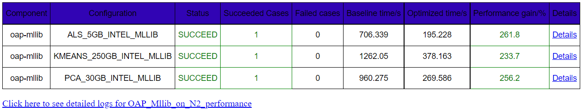

# OAP MLlib on GCP Dataproc 2.0

## 1. Creating a cluster on Dataproc

### 1.1 Uploading initialization actions

Upload the initialization actions scripts to Cloud Storage bucket. 
**[bootstrap_oap.sh](../bootstrap_oap.sh)** is to help conda install OAP packages and
**[bootstrap_benchmark.sh](./bootstrap_benchmark.sh)** is to help install necessary tools for TPC-DS and HiBench on Dataproc clusters.
    
1). Download **[bootstrap_oap.sh](https://raw.githubusercontent.com/oap-project/oap-tools/master/integrations/oap/dataproc/bootstrap_oap.sh)** and **[bootstrap_benchmark.sh](https://github.com/oap-project/oap-tools/blob/master/integrations/oap/dataproc/benchmark/bootstrap_benchmark.sh)** to a local folder.

2). Upload these scripts to bucket.


### 1.2 Create a new cluster with initialization actions

To create a new cluster with initialization actions, follow the steps below:

1). Click the  **CREATE CLUSTER** to create and custom your cluster.

2). **Set up cluster:** choose cluster type and Dataproc image version `2.0-centos8`, enable component gateway, and add Jupyter Notebook, ZooKeeper.


3). **Configure nodes:** choose the instance type and other configurations of nodes.

4). **Customize cluster:** add initialization actions as below;

5). **Manage security:** define the permissions and other security configurations;

6). Click **EQUIVALENT COMMAND LINE**, then click **RUN IN CLOUD SHELL** to add argument ` --initialization-action-timeout 60m ` to your command,
which sets timeout period for the initialization action to 60 minutes and the default timeout value is 10 minutes. You can also set it larger if the cluster network status is not good.
Finally press **Enter** at the end of cloud shell command line to start to create a new cluster.


## 2. Using benchmark-tools to easily run K-means, PCA and ALS with OAP MLlib

Run below the command to change the owner of directory`/opt/benchmark-tools`:

```
sudo chown $(whoami):$(whoami) -R /opt/benchmark-tools
```

Modify `/opt/benchmark-tools/HiBench/conf/hadoop.conf`, if you choose GCS,change the below item:
```
hibench.hdfs.master           gs://<your_bucket>/
```


### 2.1. Update the basic configuration of Spark

#### Update the basic configuration of Spark

```
git clone https://github.com/oap-project/oap-tools.git
cd oap-tools/integrations/oap/benchmark-tool
sudo cp /lib/spark/conf/spark-defaults.conf ./repo/confs/spark-oap-dataproc/hibench/spark.conf
```

### 2.2. Create the testing repo && Config OAP-MLlib

#### Create the testing repo
```
mkdir ./repo/confs/OAP_MLlib_performance
```
#### Update the content of .base to inherit the configuration of ./repo/confs/spark-oap-dataproc
```
echo "../spark-oap-dataproc" > ./repo/confs/OAP_MLlib_performance/.base
```
#### Update the content of `./repo/confs/OAP_MLlib_performance/env.conf`
```
STORAGE=gs
BUCKET={bucket_name}
```
Note: If you want to use GCS for storage, you must define BUCKET; if you use HDFS for storage, you should only set STORAGE like ```STORAGE=hdfs```

#### Update the configurations of Spark

**[bootstrap_oap.sh](../bootstrap_oap.sh)** will help install all OAP packages under dir `/opt/benchmark-tools/oap`.

```
mkdir -p ./repo/confs/OAP_MLlib_performance/hibench
vim ./repo/confs/OAP_MLlib_performance/hibench/spark.conf
```
Add below configuration to `./repo/confs/OAP_MLlib_performance/hibench/spark.conf`.

```
spark.files                       /opt/benchmark-tools/oap/oap_jars/oap-mllib-1.2.0.jar
spark.executor.extraClassPath     ./oap-mllib-1.2.0.jar
spark.driver.extraClassPath       /opt/benchmark-tools/oap/oap_jars/oap-mllib-1.2.0.jar

# Make it enough to cache training data
spark.executor.memoryOverhead               512m   
# Refer to the default value of spark.executor.cores of /lib/spark/conf/spark-defaults.conf  
hibench.yarn.executor.num                   2 
# Divide the sum of vcores by hibench.yarn.executor.num       
hibench.yarn.executor.cores                 2        
# Equal to the sum of vcores
spark.default.parallelism                   4        
# Equal to the sum of vcores
spark.sql.shuffle.partitions                4       
```

**Note:** OAP MLlib adopted oneDAL as implementation backend. oneDAL requires enough native memory allocated for each executor. For large dataset, depending on algorithms, you may need to tune `spark.executor.memoryOverhead` to allocate enough native memory. 
Setting this value to larger than __dataset size / executor number__ is a good starting point.

#### Define te the configurations of hibench.conf

Edit the content of `./repo/confs/OAP_MLlib_performance/hibench/hibench.conf` to change the 
```
# Support tiny, small, large, huge, gigantic, bigdata.
hibench.scale.profile                       tiny     
```

#### Define the configurations of kmeans.conf

Edit the content of `./repo/confs/OAP_MLlib_performance/hibench/kmeans.conf`
```
hibench.kmeans.tiny.num_of_clusters         5
hibench.kmeans.tiny.dimensions              3
hibench.kmeans.tiny.num_of_samples          30000
hibench.kmeans.tiny.samples_per_inputfile   6000
hibench.kmeans.tiny.max_iteration           5
hibench.kmeans.tiny.k                       10
hibench.kmeans.tiny.convergedist            0.5
```
Note: You can use default value of kmeans.conf and no need to change any values. If you want to change the parameters of K-means, you need to modify the value of the corresponding scale profile.

#### Define the configurations of pca.conf

Edit the content of `./repo/confs/OAP_MLlib_performance/hibench/pca.conf`
```
hibench.pca.tiny.examples                   10
hibench.pca.tiny.features                   10
hibench.pca.tiny.k                          3
hibench.pca.tiny.maxresultsize              "1g"
```
Note: You can use default value of pca.conf and no need to change any values. If you want to change the parameters of PCA, you need to modify the value of the corresponding scale profile.

#### Define the configurations of als.conf

Edit the content of `./repo/confs/OAP_MLlib_performance/hibench/als.conf`
```
hibench.als.tiny.users                     100
hibench.als.tiny.products                  100
hibench.als.tiny.ratings                   200
hibench.als.tiny.implicitprefs	           true
```
Note: You can use default value of als.conf and no need to change any values. If you want to change the parameters of ALS, you need to modify the value of the corresponding scale profile.

### 2.3. Run K-means

```
### Update: 

bash bin/hibench.sh update ./repo/confs/OAP_MLlib_performance   

### Generate data:
 
bash bin/hibench.sh gen_data ./repo/confs/OAP_MLlib_performance ml/kmeans

### Run benchmark: 

bash bin/hibench.sh run ./repo/confs/OAP_MLlib_performance ml/kmeans
```

### 2.4. Run PCA:  

```
### Update: 
bash bin/hibench.sh update ./repo/confs/OAP_MLlib_performance   

### Generate data: 

bash bin/hibench.sh gen_data ./repo/confs/OAP_MLlib_performance ml/pca

### Run benchmark: 

bash bin/hibench.sh run ./repo/confs/OAP_MLlib_performance ml/pca
```

### 2.4. Run ALS:  

```
### Update: 

bash bin/hibench.sh update ./repo/confs/OAP_MLlib_performance   

### Generate data: 

bash bin/hibench.sh gen_data ./repo/confs/OAP_MLlib_performance ml/als

### Run benchmark: 

bash bin/hibench.sh run ./repo/confs/OAP_MLlib_performance ml/als
```

### 2.5 OAP MLlib integration verification

When you run test above, you can check OAP MLlib integration verification from Spark WebUI jobs name containing "DAL" as below.


## 3. Using benchmark-tools to run workflow with OAP MLlib

### 3.1 Prepare workflow

There is one repo `./repo/workflows/oap_release_performance_test_on_Dataproc` which provides default configuration for OAP MLLib different cases. 
Please follow steps below to create a repo with the same structure and update the values you need.

Here we choose the **n2-standard-80** instances to create a cluster (1 master + 3 workers) and each instance has 80 vCPUs and 320GB memory. 

Let's take this cluster for example, we have already created corresponding directory under `./repo/workflows/` which is `./repo/workflows/OAP_Mllib_on_N2_performance`.

#### Configuration of `spark.conf`

We have already added configuration for repo `./repo/workflows/OAP_Mllib_on_N2_performance`.

```
hibench.yarn.executor.num     18
hibench.yarn.executor.cores   6

spark.executor.memory 36g
spark.executor.memoryOverhead 6g
spark.driver.memory 100g

spark.default.parallelism 120
spark.sql.shuffle.partitions  120

```

Other configurations like `hibench.conf`,`kmeans.conf`,`als.conf`,`pca.conf`, here we need more actions cause they are inherited from `./repo/workflows/oap_release_performance_test_on_Dataproc`

We set `spark.history.fs.logDirectory`  to  `hdfs:///var/log/spark/apps`, so please create a directory on HDFS as below.

```
hadoop fs -mkdir -p /var/log/spark/apps
```

and modify items of `./repo/workflows/OAP_Mllib_on_N2_performance/common/env.conf` for the cluster.
```
STORAGE=gs
BUCKET={your_bucket_name}
BASELINE_COMP=TRUE
```

### 3.2 Run OAP MLlib performance test

Run the following command to trigger OAP MLlib workflow including ALS on 5GB data scale, Kmeans on 250GB data scale and PCA on 30GB data scale

```
python2 ./bin/run_workflows.py --workflows ./repo/workflows/OAP_Mllib_on_N2_performance
```

After test, there will be a `output_workflow` directory under `./repo/workflows/OAP_Mllib_on_N2_performance/output/`. Please open the `summary.html` on browser, 
you will get OAP MLlib performance summary table as below, you can compare OAP MLlib with Baseline item which is vanilla Spark MLlib on Dataproc.

NOTE: Please ignore the current email sending issues.




