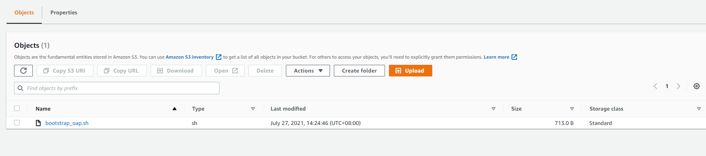
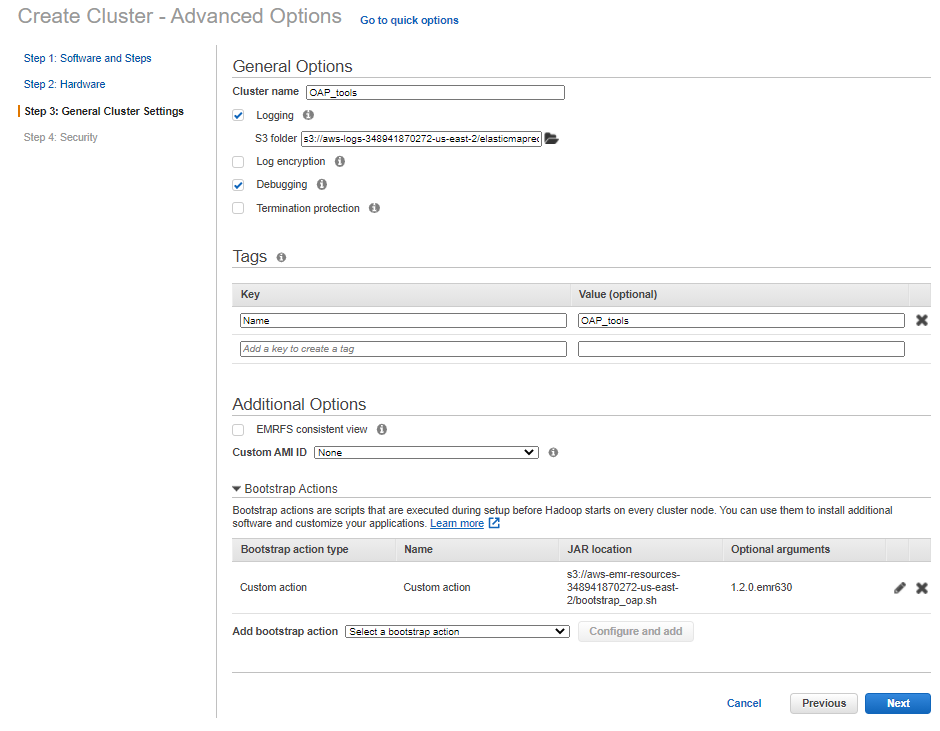

# Use OAP on Amazon EMR cloud

## 1. Upload init script 

Upload the init script **[bootstrap_oap.sh](https://raw.githubusercontent.com/oap-project/oap-tools/branch-1.2/integrations/oap/emr/bootstrap_oap.sh)** to S3:
    
1. Download **[bootstrap_oap.sh](https://raw.githubusercontent.com/oap-project/oap-tools/branch-1.2/integrations/oap/emr/bootstrap_oap.sh)** to a local folder.
2. Update **[bootstrap_oap.sh](https://raw.githubusercontent.com/oap-project/oap-tools/branch-1.2/integrations/oap/emr/bootstrap_oap.sh)** to S3.

## 2. Create a new cluster using bootstrap script
To create a new cluster using the uploaded bootstrap script, follow the following steps:

1. Click the  **Go to advanced options** to custom your cluster;
2. **Software and Steps:** choose the release of emr and the software you need;
3. **Hardware:** choose the instance type and other configurations of hardware;
4. **General Cluster Settings:** add **[bootstrap_oap.sh](https://raw.githubusercontent.com/oap-project/oap-tools/branch-1.2/integrations/oap/emr/bootstrap_oap.sh)** (install OAP binary) like following picture
(Note: the version of OAP channel need to be passed to **[bootstrap_oap.sh](https://raw.githubusercontent.com/oap-project/oap-tools/branch-1.2/integrations/oap/emr/bootstrap_oap.sh)**; the default version of OAP channel is 1.2.0; 1.2.0.emr630 fits to EMR-6.3.0 environment);

5. **Security:** define the permissions and other security configurations;
6. Click **Create cluster**. 

## 3.Enable OAP features

After bootstrap action, we have successfully installed OAP binary. If you want to use OAP feature, you still need to change some configuration of spark.
1. You can visit [Gazelle_on_EMR](./benchmark/Gazelle_on_EMR.md) to quickly enable gazelle_plugin.
2. You can visit [Intel_MLlib_on_EMR](./benchmark/Intel_MLlib_on_EMR.md) to quickly enable Intel-MLlib.

## 4. Run various workloads easily by using notebooks or benchmark tool

We provide two ways to easily run workloads with OAP feature.

1. Using notebooks
You can visit the [Notebooks User Guide](./notebooks/README.md) to learn how to use notebooks to easily generate data and run TPC-DS with gazelle_plugin.

2. Using benchmark tool
You can visit the [Benchmark tool User Guide](../benchmark-tool/README.md) to learn how to use benchmark-tool to easily run TPC-DS, TPC-H and HiBench with OAP.
